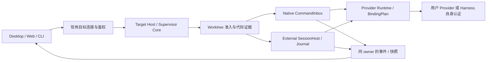

# ZCode 总体交付计划

更新时间：2026-09-29。状态：执行计划，不是完成声明。

本文件是当前唯一的项目级里程碑与交付口径。原始需求保留在 [多 Harness v0.3 计划](../ZCode_Multi_Harness_Refactor_Plan_v0.3_Orca_Hierarchy.md)，登录移除范围保留在 [产品登录移除计划](harness-refactor/REMOVE-PRODUCT-LOGIN-PLAN.md)。模块契约仍以源码旁的 contract/spec 为准；旧运行日志和阶段台账只证明对应版本，不能覆盖本文件的候选验收。

## 1. 现状、基线与本次整理范围

- 稳定主线：`main`，本次盘点时为 `30e8d0a76a73d74bc8647526c04cd94b9b44cf71`。这里的“稳定主线”指保留的默认基线，不额外宣称该历史 WIP 已获发布认证。
- 唯一集成线：`cursor/wave4-harness-integration-b7a9`，整理前为 `f130e1940c0d70ddc71d3fe586fc2a333b9f212e`，领先 main 322 个提交、变更约 500 个文件。保留原分支名，避免破坏既有引用。
- 309 个 PR 中 291 个已合入集成线，18 个打开；尚无 PR 将这批工作送入 main。原始 #1–#14 的分支 tip 已包含在集成历史中，不能再把它们视作独立待实现项目。
- 另有 107 个历史 `goal/*` 分支和 `work/multi-harness-completion` 等未入当前集成线的旧工作。它们可能包含可复用实现，但不是当前代码；按 SHA 归档，先逐项评估，再有选择地移植，不整批合并。
- 本次做分支/PR 收敛、恢复索引、模块职责梳理、历史台账纠偏和验证脚本元数据去噪。不改变任务、鉴权、模型路由或存储的运行时规则；不以整理名义强推 main。
- 验证脚本按 deleted surfaces、locale、Provider UI wiring、legacy helpers、shared contracts、status fields 六个职责拆分，共用只读 source scanner；缩减过时 PR 注释和 soft note，保留输出字段、断言与错误语义，做成功与故障注入等价校验。

分支与 PR 的逐项处理结果、归档恢复方式见 [整理记录](BRANCH-CONSOLIDATION-2026-09-29.md) 和 [机器可读清单](branch-consolidation-2026-09-29.json)。

## 2. 最终交付定义

### 第一个可用版本：原计划 P4 门槛

用户不需要产品账号，能在真实 Desktop/Web/CLI 中配置个人 Provider、选择当前受支持的原生 ZCode 或 Pi、管理 Project → Worktree → Agent Session。原生/Pi × 两个真实 Provider × 本地/SSH 共八个组合完成规定任务及恢复认证；工作区归属、审批、命令幂等、断线恢复和迁移均成立，标准发行构建可安装运行。

### 整体计划完成：P0–P6 与登录移除全部验收

在上述基础上，Codex、Claude 的控制面和模型入口分别取得真实认证；通用 ACP 接入第二个同协议 Agent，证明新增 manifest/绑定即可复用，而不是复制业务流程。能力和平台矩阵、安装诊断、升级/回滚、长期压力与资源指标、许可材料、用户说明均有可复现证据。

没有产品登录不等于没有安全边界：个人 Key、harness 自身认证、MCP OAuth、SSH/Web token/配对、Host capability、workspace admission、owner/lease 和工具审批均保留。

首批实机证据优先覆盖 macOS Desktop 和 Linux SSH。其他平台按原计划与当前产品声明逐项列入矩阵：未验证能力必须明确禁用或标明不支持。若要缩减原计划承诺的平台/功能，应另做明确范围决策，不通过改写“完成”标准悄悄删掉。

## 3. 代码职责与复用原则

| 领域                | 当前主要入口                                                                                     | 唯一事实所有者 / 整理原则                                                             |
| ------------------- | ------------------------------------------------------------------------------------------------ | ------------------------------------------------------------------------------------- |
| 共享协议和身份      | `packages/shared/src/agent-host/`、`zcode-protocol-v4/`                                          | 版本化 schema；不保存第二套运行状态                                                   |
| Project 与 Worktree | `packages/services/src/project-catalog/`、`worktree/`、`project-workspaces/`                     | Project 保存导航/展示；目标端 Worktree 拥有路径、generation、生命周期与准入证据       |
| 旧会话与层级迁移    | `packages/services/src/session-hierarchy/`、`docs/agent-host/SESSION-MIGRATION.md`               | 已有 preview/apply/CAS/backup/rollback；不改写原生 transcript，不把缓存归属当执行许可 |
| 原生任务            | `apps/zcode-cli/packages/bootstrap/src/zcode-protocol-v4/`、`packages/services/src/zcode-agent/` | 原生 CLI/CommandInbox 拥有接受队列与任务事实；Host facade 只路由                      |
| 外部 Harness        | `packages/services/src/agent-host/`、`agent-adapters/`                                           | SessionHost/Journal/Registry；注册与 capability 不等于真实模型认证                    |
| 模型与 Gateway      | `packages/provider/`、`provider-node/`、`services/src/model-provider/`、`model-gateway/`         | Provider Registry/BindingPlan/既有 Model 执行器；每 turn 绑定稳定，凭据不进入 UI      |
| 生命周期和部署      | `packages/zcode-server-cli/src/`、`packages/server/src/remote/`、`packages/desktop/src/main/`    | 现有 Supervisor/Core 与平台服务管理器；Electron 窗口是 attachment，不另造 daemon      |
| 产品界面            | `packages/ui/src/project-sidebar/`、`root/`、`v4/`，Desktop/Web renderer                         | 读取目标端公开服务；只拥有草稿、视图和选择状态，不写 owner 事实                       |

已有模块的 spec/contract 是实现边界；大文件拆分必须围绕上述职责，不能按行数机械切碎或新增第二个 Registry/队列。旧分支复用必须附“原 SHA → 当前接口差异 → 测试”记录。



## 4. 里程碑与验收门槛

“完成”必须绑定 commit、运行产物、实际平台、命令/场景、结果和脱敏证据。下表中的待验收不能因子 PR 数量增加而自动改成完成。

| 里程碑                       | 工作包及依赖                                                                          | 出口标准                                                                                                                   | 当前状态                                                      |
| ---------------------------- | ------------------------------------------------------------------------------------- | -------------------------------------------------------------------------------------------------------------------------- | ------------------------------------------------------------- |
| M0：统一基线与工作入口       | 分支归档、重复 PR 归并、总计划、职责图；将 #15 对准 main                              | 每个旧 tip 可恢复；只剩集成出口和有独立增量的 PR；main 未被未验收代码覆盖                                                  | 本次整理，结果另记                                            |
| M1：可构建的候选与旧资产评估 | 基于 M0，复核 #16/#17 与历史分支；固定依赖和 CLI 版本；修构建/类型/lint/架构错误      | 干净 checkout 可安装依赖、构建 Agent/Desktop/Web/server；无临时 shim；类型/lint/架构新错误归零；产物对应同一 SHA           | 未完成                                                        |
| M2：可信目标与持久生命周期   | M1；审查 Host ticket/bootstrap、Core ingress、owner reservation、失联/崩溃及 SSH 打包 | 未授权调用不能换取 Host 能力；目标/代际不串；现有服务管理器安装/attach/stop/升级可追踪；Crash 与断线语义实测               | 待关闭核心风险                                                |
| M3：无产品账号的完整体验     | M1；登录移除现有实现复核，个人 Provider、旧凭据退休、Web/CLI/第三方认证联测           | 新安装、升级、离线历史、Provider 401 正常；无产品授权/续期请求；个人 Key/历史/MCP/harness 认证无损                         | P1–P4 主要代码存在；整体验收未完成                            |
| M4：原生/Pi + 项目层级首版   | M2+M3；八组合真模型矩阵、同 worktree 多会话、迁移/恢复/删除、侧栏交互                 | 原生/Pi × 两 Provider × local/SSH 全部通过；关闭 GUI/断 SSH/审批恢复无重复副作用；真实 UI 与 durable owner 对得上          | 局部实现/历史证据存在；当前候选矩阵未闭环                     |
| M5：Codex / Claude 生产闭环  | M2+M3，可与 M4 的部分测试并行；统一 Gateway owner，绑定/续期/审批/上下文与 sandbox    | 两 harness 分别证明真实 CLI 控制面和真实 Provider 路由；模型身份、取消、拒绝、上下文、grant 过期和非法访问符合约定         | FakeModel/experimental 证据为主                               |
| M6：通用 ACP 与长尾 Agent    | M2+模型边界稳定；选定至少两个同协议 Agent，完成版本协商、生产注册和安装诊断           | 第二 Agent 主要通过 manifest/绑定接入；live create/send/tool/deny/cancel/resume 有证据；不把 opt-in fixture 当默认生产支持 | 有可复用 adapter 与大量 fake-transport 测试；生产/live 未完成 |
| M7：发布、压力与 main 接纳   | M1–M6 与原计划全部要求；安装/升级/回滚、负载/长期运行、文档/许可、最终评审            | 同一冻结候选的全矩阵、资源指标和安全负例通过；无未解释 skipped；#15 经最终审阅进入 main；标记 release 并移除完成分支       | 未开始总验收                                                  |

M4 是原计划允许称为“首个可用版本”的最低门槛，不是整体计划完成。M5/M6 不得只写成发布后的可选待办而仍宣称 P0–P6 完成。

### M1 的先行检查与历史资产复用

优先评估归档中的 `goal/5be7ed74-core-ingress-authority`、`desktop-auth-attachments`、`authority-product`、`ssh-package`、`load-production-driver`、`matrix-local`、`matrix-remote` 与 `work/multi-harness-completion`。这些名字只是检索线索，不是已通过声明。逐个检查：

1. 相对其 merge-base 的独立补丁和原测试证据，是否已被当前版本等价覆盖。
2. 是否仍适合当前 schema、model binding、owner 和平台边界；过期重复实现不回灌。
3. 小步移植到当前集成线并运行对应测试；不得把整个旧完成分支直接合入。
4. 在完成清单记录 adopt / superseded / rejected 及原因，结束后保留归档标签即可。

#16 的回滚演练是隔离 fixture，不能替代实际安装包回滚。#17 的实机报告基于旧业务版本和诊断包，必须保留限制；它的 macOS socket 修正应独立复核后纳入 M1/M2。两者的源码差异和待验收项见分支整理记录。

### M2 当前必须面对的风险

- 盘点版本 Core HTTP 的 `/api/rpc-host-capability` 直接签发能力，且只限制 loopback、标记 `authRequired: false`。本机端口或 SSH tunnel 的可达性不是调用者身份。先做威胁模型和私有 bootstrap/control 认证，再跑攻击负例。
- 原生与外部任务不能在窗口退出时被错误停止；owner/lease、generation、in-flight admission、crash recovery 需要进程级证据，不能只靠内存 mock。
- 本地和 SSH 复用现有 Supervisor，保留 Desktop continuous 与 Web replayable 的不同传输语义。

### M3 当前必须证明的保留能力

- 旧 OAuth 键不再被解密/导出/续期，但不清空个人凭据库。
- 产品登录 UI/服务缺席不影响 Provider 配置、harness 自身认证或 MCP OAuth。
- 已停用的云端产品能力给出明确不可用状态；不能用用户 Provider Key 冒充产品 JWT，不能匿名开放原受保护接口。

## 5. 验收矩阵和证据等级

| 维度         | 最低证据要求                                                                                                                |
| ------------ | --------------------------------------------------------------------------------------------------------------------------- |
| 构建与工具链 | 固定 Node/pnpm/SDK/CLI 版本；干净 checkout 产物的 SHA/hash；标准入口结果                                                    |
| 模型任务     | 实际 provider/model/route；读→改→固定测试→下一轮追问；usage 与失败记录；授权拒绝无副作用                                    |
| 运行恢复     | GUI 全退、SSH 断线、pending approval、Core crash、reconnect；相同 command/request/owner，副作用不重复                       |
| 层级与历史   | 两项目、多个主/linked worktree、同工作区三会话；多 target 同路径；cold/offline/stale 不冒充 live；历史可读与执行准入分开    |
| 迁移与回滚   | preview/apply 幂等、revision 竞争、备份、回滚、坏文件/未来 schema；不改原始 cwd/ID/transcript                               |
| 协议和安全   | 拒绝未授权 Host/Web 访问、过期 grant、陈旧 generation；敏感信息不进日志/仓库；正常第三方认证仍可用                          |
| 压力与性能   | 原计划 50 worktree / 10 session / 100k events / 8h soak；开始前固定机器规格、p95/延迟、内存、泄漏和恢复阈值，不跑完再改阈值 |
| 发布         | 同一候选安装、升级、回滚；支持矩阵、故障说明、开源许可及产物核验                                                            |

证据等级采用：**源码存在 → 确定性测试 → 标准构建 → 真实环境 → 冻结候选发布验收**。低等级通过不能提升为高等级。skip、blocked、失败后重试、未授权平台分别记录，不统一写成通过。

每条记录包含：需求/M 编号、完整源码 SHA、产物 hash（如适用）、平台与目标类型、工具版本、运行入口、pass/fail/blocked/skipped、证据链接、剩余风险。原始 Key/地址/prompt 不提交。临时 `/tmp` 日志不是唯一长期证据；提炼可公开的结果与必要关联 ID。

## 6. 分支、PR 和代码工作方式

```text
main（保留默认基线）
  ↑ #15：唯一发布接纳 PR，保持 Draft 直到候选门槛达标
cursor/wave4-harness-integration-b7a9（唯一集成线）
  ↑ 有明确 M 编号与出口标准的短分支 / PR
archive/2026-09-29/*（只读历史标签，不能作为新功能默认基线）
```

- 新工作从最新集成线开始，一个 PR 交付一个可验收工作包，标题/描述引用 M 编号和实际差异；不再只为追加 tip SHA 或单独同步一条 PR 台账创建 PR。
- 修改代码先读对应模块 context/spec/contract。测试、必要文档与代码在同一 PR；确有独立风险/依赖才拆分。
- PR 合入后删除其短分支。存在独立新提交、被其他活跃 PR 用作 base、受保护或正在执行的工作不得直接删除；先核对 SHA、依赖与恢复点。
- 验收失败回到对应工作包，不能靠改文案、缩小断言或反复增加模拟组合替代失败的生产场景。
- main 的推进是明确发布操作，不把“291 个子 PR 已合并”当作发布证据。最后直接完成 #15 → main，不再经过 wave1 等多层转运。

## 7. 优先顺序、依赖与容量

第一轮只启动 M1 的构建基线/旧资产筛选，以及 M2 的鉴权设计审查。M1 稳定后推进 M2、M3；随后集中完成 M4 的首版真实矩阵，再关闭 M5/M6。M7 在冻结候选上统一验收。

上述“并行”是计划中允许的任务关系，不代表本次启动了其他代理或修改其他聊天。每个工作包指定一名负责人和一名验收人；未分配前不宣称有人在执行。共享契约、node.ts 组合根和 Provider/Host 所有权变更必须串行收敛。

目前不承诺日期或完成百分比。M1 结束后，按真实失败数、待采纳旧补丁、平台资源可用性和每个工作包验收工作量估算人日；区分实现、测试、等待外部条件与风险余量。真实 Provider/远端测试使用用户已授权的服务及目标，新的目标或凭据缺口单独说明，不凭空补环境。

## 8. 本次整理验证与交付

本次检查结果写入 [整理记录](BRANCH-CONSOLIDATION-2026-09-29.md)。本次并未运行 M4–M7 的全量付费/远端/GUI/压力验收，也未修改运行时实现。

总体完成检查表：

- [ ] M1 标准构建和质量门禁通过，旧分支资产已分级处理。
- [ ] M2 可信连接、生命周期及安全负例通过。
- [ ] M3 无产品登录与保留能力全入口验证通过。
- [ ] M4 原生/Pi 八组合及项目层级/迁移 UI 验收通过。
- [ ] M5 Codex/Claude 的生产控制面与模型面通过。
- [ ] M6 通用 ACP 的第二生产 Agent、诊断与兼容通过。
- [ ] M7 同一冻结候选的压力、安装/升级/回滚、许可及发布评审通过。
- [ ] #15 已按通过的候选提交进入 main，完成分支已回收。
