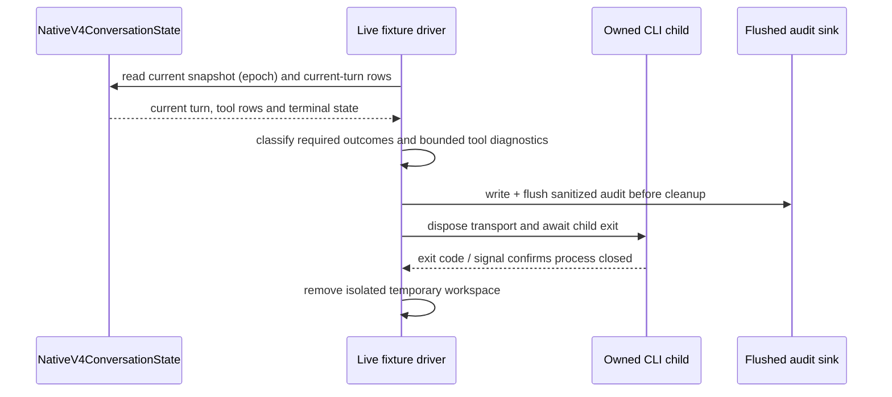

# P3 live Pi route certification

This is the acceptance ledger for real Provider calls through the existing
`ProviderRegistry`/`AiSdkModelAdapter` path and the Pi 0.87.1 worker. Fake model
tests are evidence for deterministic behavior only; they are never live route
certification.

## Historical P3 Pi run limits

The first P3 live route was authorized under a historical ¥50 RMB ceiling and
StepFun-only scope. That ceiling is preserved as history; the latest native V4
revalidation authorization has no monetary hard cap and permits only the
specified minimal StepFun and AxonHub runs. It does not convert ¥50 to USD.
The historical Pi runs were bounded by:

- at most 8 model requests per target (the small allowance covers the tool loop,
  follow-up and denied-write check);
- at most 512 output tokens per request;
- a prompt kept below 8,000 input tokens, with the run stopped if reported
  input usage exceeds that bound;
- one small temporary worktree, one approved two-turn task and one denied-write
  check; final certification runs do not retry an upstream or bridge failure
  (development attempts remain in the all-request ledger below);
- the run stops immediately on an unexpected tool, a path outside the
  temporary worktree, a missing usage report, a provider error, or a cost
  estimate that cannot be computed.

The request guard observes the adapter's `model_request_started` milestone.
That is a logical model attempt, not proof that a billable HTTP request reached
the Provider. A rejected guard start is recorded as blocked-before-send only
when the fixture rejects it before opening the provider stream. Failed starts
without a usage response remain unknown for physical-send and billing
purposes. The Mac AxonHub guard exit is retained as a logical attempt; its
physical send outcome is not inferred from that event alone.

The StepFun estimate uses USD 0.10/M input and USD 0.30/M output with an
explicit planning conversion of ¥8/USD. It is an estimate from reported usage,
not a billing receipt or hard spending limit. The official StepFun rate page
was unavailable to this environment.

AxonHub `deepseek-v4-flash` has no verified public proxy rate card, and
DeepSeek origin pricing cannot be used as an AxonHub price. The latest
authorization permits only the minimal necessary AxonHub calls; actual usage
must be recorded separately and no price is guessed.

## Scenario

For each permitted target, the fixture creates a fresh temporary worktree with
an input file, a requested output file and a tiny test script. The real Pi
agent must read the input, write the exact output, run the test, and answer a
follow-up question in a second turn. The approval callback allows only
write/edit calls whose hook has already proved the path is inside that
worktree, and allows only the exact test command. A separate write request is
denied; the expected result is no output file and no recorded tool side effect.

The trace records the requested and effective `providerId/modelId`, route
`pi-sdk`, Pi SDK version `0.87.1`, target, model request count, each usage
report, estimated USD amount and remaining budget. Errors are sanitized before
they enter the log.

## Evidence ledger

| Target / Provider                                             | Model               | Result                                          | Requests | Usage / estimated cost                               | Evidence                                                                |
| ------------------------------------------------------------- | ------------------- | ----------------------------------------------- | -------: | ---------------------------------------------------- | ----------------------------------------------------------------------- |
| local Linux / StepFun                                         | `step-3.5-flash`    | pass                                            |        8 | 15,494 input / 1,174 output; USD 0.0019016 estimated | `/tmp/zcode-live-cert-stepfun-local-pass5.log`                          |
| macOS target-1 / StepFun                                      | `step-3.5-flash`    | pass                                            |        8 | 15,575 input / 788 output; USD 0.0017939 estimated   | `/tmp/zcode-live-cert-stepfun-mac.log`                                  |
| local Linux / StepFun (current structured-thinking bridge)    | `step-3.5-flash`    | pass                                            |        8 | 15,684 input / 1,458 output; USD 0.0020058 estimated | `/tmp/zcode-live-cert-stepfun-local-current.log`                        |
| macOS target-1 / StepFun (current structured-thinking bridge) | `step-3.5-flash`    | pass                                            |        8 | 16,084 input / 972 output; USD 0.0019000 estimated   | `/tmp/zcode-live-cert-stepfun-mac-current.log`                          |
| local Linux / AxonHub                                         | `deepseek-v4-flash` | pass with Mac literal key in private SSH memory |        9 | 16,470 input / 738 output; USD not estimated         | [`axon-linux-current.log`](/tmp/zcode-live-cert-axon-linux-current.log) |
| macOS target-1 / AxonHub                                      | `deepseek-v4-flash` | authenticated; stopped after request guard      |        9 | 19,834 input / 820 output; USD not estimated         | [`axon-mac-current.log`](/tmp/zcode-live-cert-axon-mac-current.log)     |
| macOS target-1 / AxonHub (deny-only)                          | `deepseek-v4-flash` | pass: deny/cancel/tool blocked                  |        2 | 1,672 input / 151 output; USD not estimated          | private deny-only run; no file side effect                              |

The historical Pi ledger records 94 logical `model_request_started` attempts:
73 StepFun and 21 AxonHub. The start milestone does not prove a physical or
billable HTTP request. StepFun had 69 usage reports (136,020 input / 8,377
output tokens) and 4 attempts without usage; AxonHub had 19 usage reports
(37,976 input / 1,709 output tokens) and 2 attempts without usage. Those six
missing-usage outcomes remain unknown for physical send and billing purposes.
The StepFun reported-usage estimate was USD 0.0161151. Under the historical
per-request planning cap, the four unreported StepFun attempts add an estimated
USD 0.0038144, for a Pi-only historical planning estimate of USD 0.0199295
(¥0.1594 at ¥8/USD). This is not a billing receipt or the cumulative estimate
for later native runs. AxonHub's proxy price is unknown, so no amount is
invented. The earlier Linux request used literal command-reference text (the
reference was not executed) and failed authentication. The authorized Linux
Pi run used the Mac literal key through private SSH stdout memory and passed
the approved/deny fixture. The Mac AxonHub run authenticated and passed its
first two turns; its last observed start was stopped by the historical guard,
and its physical-send outcome is not inferred from the start event. A separate
deny-only run passed. Raw errors were removed from local logs. This is
accounting evidence, not a billing receipt. These runs used real Provider
responses through the structured-thinking Pi bridge; none used the fake model
executor from deterministic tests.

The first real StepFun response emitted reasoning chunks. Provider metadata and
official model materials indicate that this model does not expose a true
disable switch, so the corrected fixture selects `reasoningLevel=low` and the
bridge preserves those chunks as structured Pi thinking. The focused bridge
regression and both current target runs pass with this explicit constraint; the
route is not evidence of provider reasoning being disabled.

This ledger does not certify SSH persistence, GUI exit/reconnect, native ZCode
ownership, or the remaining P3/P4 provider matrix.

## Native V4 offline route

The native fixture [`certifyNativeV4Route.ts`](../../packages/services/test/fixtures/certifyNativeV4Route.ts)
starts the built ZCode CLI with `app-server --stdio`, a temporary
`ZCODE_DATA_BASE_DIR`, a temporary personal Provider Config and a loopback fake
OpenAI-compatible gateway. It does not contact a real Provider and does not
read or write the user's data root. The fake gateway is reached only after the
native CLI has accepted the V4 `createSession` command and the conversation has
been subscribed.

The current Linux offline repair passed with Node `v24.14.0` and pnpm `10.33.2`.
Its log is
[`native-fake-offline-final-5.log`](/tmp/zcode-gpt6-native-offline-repair/native-fake-offline-final-5.log).
The route verified the full Read→Write→Bash check→terminal turn, a separate
follow-up, backend permission allow and deny, V4 stop, and history. The fake
gateway handled nine loopback requests: eight for those four turns and one
separate first-turn title-generation sidecar. The title sidecar did not advance
the follow-up response plan. History snapshots contained 15 rows after stop;
the nonce check marker was exact and the denied file remained absent. The CLI
artifact SHA-256 was
`a62d891f89abb2d78bd1b24387b441e82d02aa32fc460c3c6d613beed58104a7`. Its
pre-send fetch audit recorded nine logical attempts, nine native invocations,
eight HTTP responses, one cancelled stop request, no failures, no blocked
sends, and no unknown outcomes. These are offline fake-provider results only.
The preceding offline attempt remains a failure in
[`native-fake-offline-final.log`](/tmp/zcode-gpt6-native-final-validation/native-fake-offline-final.log);
its unexpected `native-denied.txt` approval is not promoted to a pass.

This fake section is native CLI/CommandInbox evidence only; by itself it does
not claim a real StepFun/AxonHub call, GUI persistence or SSH daemon
reconnect. The real-provider evidence below is recorded separately.

The fixture is split into a small driver, common isolated-config helpers, a
fake gateway entry and a live-provider entry. The fake denial assertion waits
for the native pending tool row and its terminal status before checking the
workspace, so it does not use a fixed delay as a synchronization mechanism.
The same fake route passed on macOS with the fixed toolchain Node `24.14.0`
and pnpm `10.33.2` (seven loopback requests and nine history rows), using the
same CLI artifact hash. Local SSH summary evidence is in
`/tmp/zcode-native-v4-fake-node2414-rerun.stdout`; the remote log is
`/tmp/zcode-native-v4-fake-node2414-rerun.log`.

### Offline fake-route contract

The fake gateway owns explicitly activated fixture turns and their request
histories. Every Provider request is matched to a scenario and fixture turn by
the active turn plus its user prompt and message history. The title-generation
sidecar is matched separately by its title system prompt and exact first-turn
input, even when it arrives after the full turn and overlaps the follow-up. The
gateway accepts only the OpenAI-compatible model route, rejects unknown
scenarios, and fails closed on unexpected request history. Probe traffic and
fetch-guard self-tests run outside scenario histories and cannot advance a
response plan.

The full turn returns Read `input.txt`, Write `output.txt`, Bash with the
fixture's exact `check.mjs` command, then a terminal answer, in that order. The
follow-up, permission-denial, and stop turns each have separate scenario IDs
and response histories. The denial scenario alone offers `native-denied.txt`;
the stop scenario holds its own response until the V4 stop is accepted. No
global HTTP request number selects a scenario response.

After the first prompt, the CLI may also send an asynchronous session-title
sidecar request with its own title-generation system prompt and the original
user input. That request can arrive after the full conversation turn has
completed and while the follow-up is active. The gateway associates it with
the full turn by both its title-generation prompt and exact original input,
returns a separate title fixture response, and leaves the follow-up history
unchanged. The driver waits for that sidecar response by its scenario and
fixture turn ID before auditing the completed offline route.

```mermaid
sequenceDiagram
  participant D as Native driver
  participant C as CLI runtime
  participant G as Fake gateway
  participant V as V4 snapshot owner
  D->>G: activate full scenario with exact prompt
  D->>C: send full input
  C->>G: Read, Write, Bash check, terminal requests
  G-->>C: respond from full-turn history
  C-->>V: conversation wire frames
  V-->>D: assembled current snapshot
  C->>G: title sidecar with original input
  G-->>C: separate title-generation response
  D->>G: activate follow-up scenario
  D->>C: send follow-up input
  C->>G: follow-up request matching its own history
  G-->>C: follow-up response
  C-->>V: pending approval snapshot
  V-->>D: current turn + tool row + interaction ID
  D->>C: resolve the matched interaction
  Note over C,G: Title sidecar may overlap follow-up; it never advances the follow-up plan.
```

The driver owns the current V4 conversation snapshot. It decodes the public
conversation wire schema, uses the shared topic-wire assembler, and applies
only frames matching the subscribed session, subscription ID, and log epoch
at a contiguous sequence. Approval may be resolved only from that current
snapshot's `pendingInteractions` when its permission payload, pending tool row,
interaction ID, and active turn ID agree. Historical or recursively nested
objects are not approval sources. Interaction resolution follows the
authoritative state update; fixed sleeps are not synchronization.

## Native real-provider matrix

### Revalidation acceptance contract

The next Linux revalidation is gated by one full StepFun run on the fixed Node
`v24.14.0` / pnpm `10.33.2` toolchain. Only if it passes may there be one full
AxonHub run and one StepFun permission-denial control; each authorized scenario
runs once. It reuses the current built CLI artifact and records its SHA-256.
The prompt identifies this as a small fixture and asks for Read of `input.txt`,
Write/Edit of `output.txt`, exactly one Bash execution of the supplied check
script, and a concise follow-up. It asks the model to reply without further
tool calls after the check. It forbids planning, delegation, and changes to the
check script. Each response is allowed up to 2,048 output tokens; StepFun uses
reasoning `low`, AxonHub uses reasoning `off`.
The live model option spec sets its maximum to the smaller of 2,048 and the
Provider model metadata maximum. The driver stops before sending when metadata
advertises less than 2,048. The native turn runner derives its ordinary request
budget from this model option maximum; the session selection carries the
provider-supported `reasoningLevel` option.

The bounded read allowlist also permits `output.txt` and the generated
`check.mjs`: a model may check whether its output exists before writing, and may
inspect the fixed check. An `output.txt` Read error is recoverable when the
required later input Read, output Write/Edit, successful check and terminal
outcomes all pass. Other tool errors are retained as per-tool diagnostics and do
not alone fail a run when the required successful outcomes are present. A row
still fails closed when its tool is unsupported, its path escapes the fixture,
its in-fixture path is outside this exact allowlist, or its Bash command does
not match the fixed check invocation. No tool arguments, prompts, endpoint,
headers or credentials enter diagnostics.

The fixture generates `check.mjs` itself from fixed content. That script
compares the complete expected output bytes, then writes a per-run nonce marker.
The fixture verifies the check script is byte-for-byte unchanged and accepts
the check only when all three facts agree: a successful Bash tool row contains
an exact recognized invocation of `check.mjs`, the nonce marker has the exact
expected content, and the generated check script still matches its original
hash. Command matching allows harmless spellings such as `node ./check.mjs`
and the exact absolute path; it rejects added shell commands and substring
matches. The fixture checks tool rows for the current turn and log epoch. It
requires a successful Read of `input.txt` before a successful Write/Edit of
`output.txt`, then a successful exact Bash check invocation and a
completed-success turn with terminal assistant text. The output bytes must
match exactly, the nonce marker must match, and `check.mjs` must remain
byte-for-byte unchanged. Additional failed rows are acceptable only for the
exact allowed tools, paths and check command; they cannot replace any required
successful outcome. The independent follow-up must also complete successfully
with assistant text. A model's prose or a marker file by itself cannot pass the
scenario.

Failure audit rows are keyed by the current turn ID, snapshot log epoch and
tool-call ID. They classify unsupported tools, paths outside the fixture,
unapproved paths inside the fixture, check-command mismatches, failed allowed
operations, and missing required final outcomes separately. They include only
fixture-relative paths, a bounded command classification, tool status and a
safe error category. Bash diagnostics include only a finite command-head enum,
known fixture-relative paths, operator kinds and a bounded mismatch reason; they
omit command text, arbitrary arguments and absolute paths. Operation-policy
rejections and missing-required-outcome failures have separate error classes.
After a terminal full turn, the driver also hashes and
checks the expected output bytes, nonce marker and fixed check script before
evaluating tool-scope failures. It records only match booleans and hashes. The
audit is flushed before child cleanup removes the temporary directory; cleanup
records the owned CLI child's exit and verifies that it has closed.



The child-process pre-send fetch guard allows at most 16 native fetch sends for
each full run and at most 6 for the permission-denial control. It is loaded
before the CLI bundle and records logical model attempts (from V4 usage), fetch
attempts, sends actually issued, HTTP responses/errors, sends blocked before
network invocation, fetch failures, cancellations, and unresolved outcomes
separately. The offline native fake route must first show that OpenAI-compatible
and Anthropic endpoint requests pass through this guard, and that an aborted
request's cancellation record is flushed before the child exits. This is
bounded by physical fetch sends; V4 usage remains aggregate and is not used to
stop a turn after the fact.

Each guarded attempt also records one safe route class: title sidecar, provider
model route, auxiliary route, or unknown route. Title classification examines
the known title-generation marker in the request body in memory; audit output
contains only aggregate route counts, never the URL or request body. The live
attempt record reports these counts alongside aggregate runtime usage and fetch
outcomes so sidecar and auxiliary traffic remain visible without retaining
prompts or tool arguments.

A fetch outcome is unknown when a logical guarded fetch attempt has no terminal
record for a pre-send block, HTTP response, fetch failure, or cancellation.
This includes attempts that never reached native `fetch` as well as invoked
fetches whose completion was not recorded.

Revalidation is gated by the single StepFun full run. Only if it passes, make at
most one AxonHub full run and at most one StepFun native permission-denial
control; each scenario runs once and a failed scenario is not retried. A failed
StepFun full run prevents both later calls. Each attempt keeps its complete
sanitized audit. The control uses `build` mode and requests a write to a
dedicated path outside the temporary workspace, waits for a real backend
permission interaction, declines it, verifies the matching error tool row and
absent sentinel, then stops the turn. Its fetch cap is six sends. Edit-mode
`interactions: 0` is not approval evidence, and no native permission control is
inferred from AskUserQuestion.

Both live and fake drivers use the shared `NativeV4ConversationState` as the
single owner of the subscribed snapshot. A permission decision requires a
pending permission interaction and pending tool row in the active running turn
with matching interaction ID and tool-call ID. The live driver does not derive
approval from recursively nested notifications or historical rows; it sends
the resolve command only after the assembled snapshot passes those checks.

### Earlier Linux attempts

The two failed Linux revalidation attempts below used the earlier 512-token
per-response setting and did not have the final success marker / command
parser. The V4 usage API only publishes aggregate request/error counts and
tokens, so it could not enforce the then-used logical-attempt ceiling inside a
model/tool turn. Those attempts remain failures and are never promoted by the
offline fixture changes or by earlier successful runs.

The previous StepFun deny-only plan used `build` mode and a path outside the
workspace to exercise the CLI permission service. It was not run because the
single StepFun full attempt below exceeded the earlier logical-attempt
ceiling. Thus no native real-provider permission denial is certified by those
attempts.

Native accounting keeps runtime logical attempts, fetch attempts, native fetch
invocations, HTTP responses/errors, pre-send guard blocks and unknown outcomes
as separate facts. V4 usage does not prove that every logical start became a
billable HTTP request. Any failed attempt without a response usage report
remains unknown. StepFun cost is a planning estimate using USD 0.10/M input,
USD 0.30/M output and ¥8/USD; AxonHub's proxy rate is unknown.

The live entry uses the same official Provider Registry file schema as the CLI,
with credentials resolved into a mode-0600 file inside the temporary data
directory. Linux AxonHub uses the already-approved private SSH lookup of the
Mac literal credential; it never executes the Linux command-reference value.
For loopback AxonHub endpoints, the child process clears inherited proxy
variables and sets `NO_PROXY`, so the request reaches the configured local
service directly. No request body, key, endpoint credential or user data is
written to the repository or printed in the ledger.

| Target / Provider        | Model / reasoning           | Result                          | Native model requests |                                                        Usage | Evidence                                                                                                       |
| ------------------------ | --------------------------- | ------------------------------- | --------------------: | -----------------------------------------------------------: | -------------------------------------------------------------------------------------------------------------- |
| Linux / StepFun          | `step-3.5-flash` / `low`    | pass: read→edit→check→follow-up |                     3 |   12,194 input / 333 output; USD 0.0013193 planning estimate | `/tmp/zcode-native-live-linux-stepfun-rerun2.log`                                                              |
| macOS target-1 / StepFun | `step-3.5-flash` / `low`    | pass: read→edit→check→follow-up |                     8 | 14,036 input / 1,715 output; USD 0.0019181 planning estimate | remote `/tmp/zcode-native-live-mac-stepfun.log`, local SSH summary `/tmp/zcode-native-live-mac-stepfun.stdout` |
| Linux / AxonHub          | `deepseek-v4-flash` / `off` | pass: read→edit→check→follow-up |                     9 |         13,706 input / 812 output; proxy price not estimated | `/tmp/zcode-native-live-linux-axonhub-rerun.log`                                                               |
| macOS target-1 / AxonHub | `deepseek-v4-flash` / `off` | pass: read→edit→check→follow-up |                     5 |         13,026 input / 262 output; proxy price not estimated | remote `/tmp/zcode-native-live-mac-axonhub.log`, local SSH summary `/tmp/zcode-native-live-mac-axonhub.stdout` |

The fixed-Node Linux revalidation attempts were each made once and neither is
a pass:

| Target / Provider                  | Result                                                                                                                          | Runtime model attempts | Fetch audit                                                                                                                                                               | Usage                                                                               | Evidence                                                                                                               |
| ---------------------------------- | ------------------------------------------------------------------------------------------------------------------------------- | ---------------------: | ------------------------------------------------------------------------------------------------------------------------------------------------------------------------- | ----------------------------------------------------------------------------------- | ---------------------------------------------------------------------------------------------------------------------- |
| Linux / StepFun                    | failed before follow-up: aggregate usage exposed 12 attempts; the fixture stopped before sending follow-up                      |   12, 0 runtime errors | guard was added after this run; physical HTTP count unknown                                                                                                               | 14,145 input / 1,951 output; USD 0.0019998 planning estimate (¥0.0159984 at ¥8/USD) | `/tmp/zcode-gpt6-native-validation/native-live-linux-stepfun-node2414.log`                                             |
| Linux / AxonHub                    | failed after first turn: fixture did not confirm a successful `node check.mjs` tool row, so no follow-up was sent               |    6, 0 runtime errors | observed audit: 7 logical fetch attempts; 7 native fetch invocations; 6 HTTP responses; 0 HTTP errors; 0 fetch failures; 1 outcome unknown at stop; 0 blocked before send | 13,216 input / 770 output; proxy price unknown                                      | `/tmp/zcode-gpt6-native-validation/native-live-linux-axonhub-node2414.log`                                             |
| Linux / StepFun (current one-shot) | failed before follow-up: a tool row was outside the fixture allowlist; no operation was approved                                |    4, 0 runtime errors | 5 logical guarded fetch attempts; 4 native invocations; 4 HTTP responses; 0 HTTP errors/failures/cancellations/blocks; 1 unknown outcome after reconciliation             | 11,596 input / 411 output; USD 0.0012829 planning estimate (¥0.0102632 at ¥8/USD)   | `/tmp/zcode-gpt6-native-live-final/stepfun-full.jsonl`; audit correction in `stepfun-fetch-audit-reconciliation.jsonl` |
| Linux / AxonHub (current one-shot) | failed closed at permission gate: requested operation was outside the exact fixture operations; no resolve command or follow-up |    7, 0 runtime errors | 7 logical guarded fetch attempts; 7 native invocations; 7 HTTP responses; 0 HTTP errors/failures/cancellations/blocks/unknown                                             | 12,460 input / 626 output; proxy price unknown                                      | `/tmp/zcode-gpt6-native-live-final/axonhub-full.jsonl`                                                                 |

Those one-shot failure records did not preserve the current-turn tool rows
before deleting the temporary workspace. Their exact tool, path, command and
status causes are therefore unknown; neither failure is reclassified from the
aggregate message. The revised driver emits bounded per-row diagnostics before
cleanup for any future attempt.

An earlier offline fake-route pass exposed that fetch-audit file writes were
not awaited at the send boundary, so an entry could be missing if the child
stopped during a request. The guard now flushes each pre-send attempt and
invocation record before calling fetch. That audit fix did not retroactively
prove the earlier AxonHub attempt's physical-send count; that run remains
unverified at the stop boundary and was not repeated. The current fake scenario
repair is documented in the Native V4 offline route section above.

The earlier successful native matrix has 25 runtime-reported model requests.
The two prior failed native probes still have unknown request counts and usage.
At that earlier checkpoint, adding the StepFun 12 and AxonHub 6 runtime
attempts brought the known logical-attempt total to 137, plus those two earlier
probes with unknown counts. The StepFun 12-attempt run's usage estimate was
known, but its physical fetch count was not instrumented; the AxonHub six-attempt
run's fetch count remained incomplete at stop. Across all known StepFun usage
in the Pi ledger, the earlier native successes and the StepFun 12-attempt
failure, the planning estimate is USD
0.0213523 (¥0.1708184 at ¥8/USD). This sum is not a billing receipt and does
not a total charge. The four historical Pi StepFun attempts without usage have
their separate historical cap-based planning allowance of USD 0.0038144; two
other Pi attempts and the two earlier native probes have no usage and remain
unpriced. AxonHub has 77,924 input / 3,553 output tokens across its known
Pi/native usage, but its proxy price is unknown. The latest runs certify only
native CLI and model execution paths; GUI interaction, persistence, SSH
disconnect and reconnect remain untested.

The current one-shot attempts above used Node `v24.14.0`, pnpm `10.33.2`, and
the isolated CLI artifact built from the current checkout, SHA-256
`c226d699578b766c60b7d0d4614bdc9fee206959432c2a566c3348310fc22204`. The
repository's older CLI bundle was left untouched. Both native CLI children
exited normally: StepFun PID 47 and AxonHub PID 56, each exit code 0 with no
signal. Each route stopped after its first-turn failure and was not retried.
The StepFun permission-denial control was skipped because the required StepFun
full route did not pass; no native real-provider permission denial is certified.

The prior known logical-attempt checkpoint was 137 plus two earlier probes
with unknown counts. These two runs add 11 known runtime model attempts (4
StepFun and 7 AxonHub), bringing the known lower bound to 148 plus those two
unknown probes. StepFun reported usage adds USD 0.0012829 to the prior
USD 0.0213523 planning estimate, for USD 0.0226352 (¥0.1810816 at ¥8/USD);
these are usage-based estimates, not billing receipts. Known AxonHub usage is
now 90,384 input / 4,179 output tokens; its proxy price remains unknown.

The V4 usage response is session-aggregate and cannot classify token usage for
title-generation sidecars; the guarded fetch audit now reports route counts
separately. Fetch counts above include all observed guarded attempts. The
StepFun fifth guarded attempt had no terminal audit record and is recorded as
one unknown outcome; it is not assumed to have reached the network or to be
billable. No request bodies or provider credentials were retained.

### Latest gated Linux attempt

The single StepFun A run authorized after the offline repair did not pass and
was not retried. The first full turn reached `completedSuccess`; the required
input Read, output Write, exact fixed Bash check and terminal assistant text
were present. It also contained a successful second Bash row classified as
`command-mismatch`, so the operation-policy gate rejected the turn and did not
send the follow-up. The saved audit's `missing` list is empty. Its top-level
`errorClass` still uses the earlier generic `required-outcome` label; the row
classification establishes the policy failure. The old failure path did not
check or retain output-byte, nonce-marker or check-script-hash evidence before
cleanup, so those facts remain unknown for this attempt. The extra command text
was not retained and is not inferred.

| Stage / target          | Result                                                                                       |  Runtime attempts | Fetch and route audit                                                                                                                                                                              | Usage / estimate                                                              | Evidence                                                    |
| ----------------------- | -------------------------------------------------------------------------------------------- | ----------------: | -------------------------------------------------------------------------------------------------------------------------------------------------------------------------------------------------- | ----------------------------------------------------------------------------- | ----------------------------------------------------------- |
| A: Linux / StepFun      | failed operation-policy check after first full turn; extra Bash mismatch; follow-up not sent | 5, 0 model errors | 6 guarded attempts / 6 native fetch invocations / 5 HTTP responses; 0 HTTP errors, failures, cancellations or blocks; 1 unknown. Routes: 1 title sidecar, 5 provider model, 0 auxiliary, 0 unknown | 11,771 input / 538 output; USD 0.0013385 (¥0.010708 at ¥8/USD), planning only | `/tmp/zcode-gpt6-native-plan-validation/stepfun-full-A.log` |
| B: Linux / AxonHub      | skipped because A failed                                                                     |                 — | no calls                                                                                                                                                                                           | proxy price remains unknown                                                   | gated off                                                   |
| C: Linux / StepFun deny | skipped because A failed                                                                     |                 — | no calls                                                                                                                                                                                           | not applicable                                                                | gated off                                                   |

The new A run adds five runtime logical attempts to the known lower bound of
148, making 153 plus the two older unknown-count probes. Its one unresolved
fetch outcome is added separately and is not treated as a confirmed upstream
response or charge. The StepFun usage estimate becomes USD 0.0239737
(¥0.1917896 at ¥8/USD), still a planning estimate rather than a billing receipt;
AxonHub remains unpriced. The child used Node `v24.14.0`, exited normally as PID
53, and its isolated temporary directory was removed. It used the isolated CLI
artifact SHA-256 `47d04776e7bae1d78e395b6fdc99e4ae9ec5888a12b2cfcf77eef78478cba0b6`
from source fingerprint `e1aaff6e3817a30586c08e3cc60b026126e641c93c1af853eada0ad2f4dfea60`;
the repository CLI artifact remained unchanged. No later live scenario was
run. The complete native/Pi × Provider × local/SSH matrix remains incomplete,
as do GUI persistence and SSH reconnect evidence.
