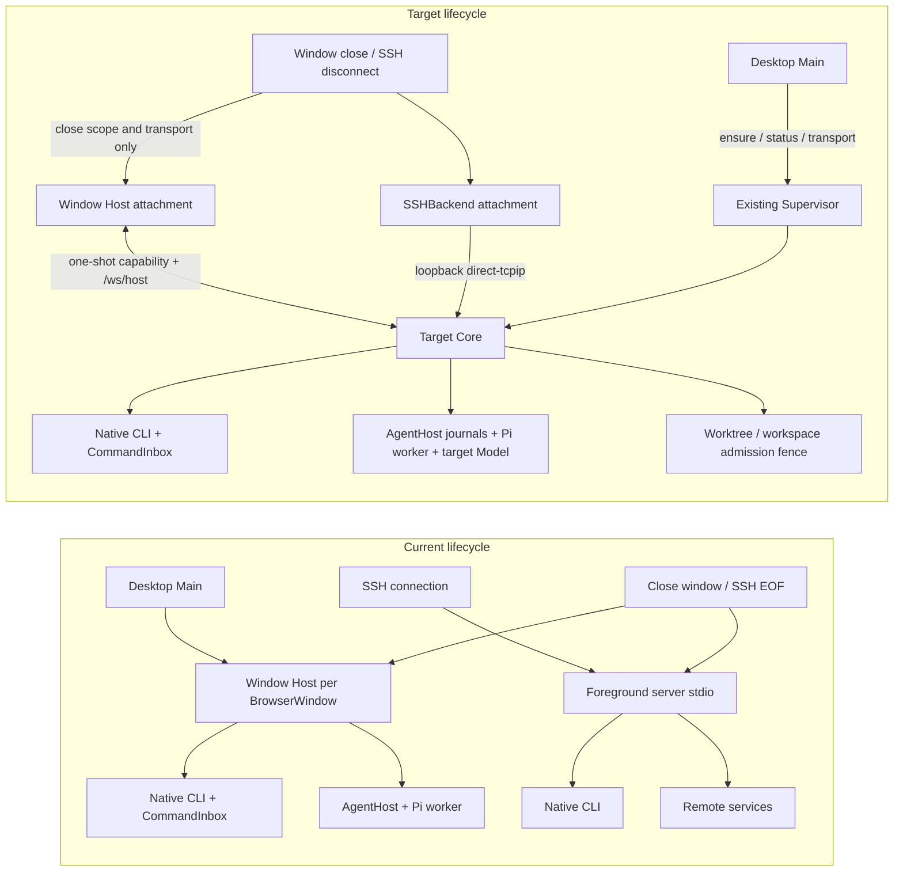

# Supervisor and AgentHost runtime ownership

The checked-in runtime already has one Supervisor, one Server Core child, and
one data-root lock. `serve --daemon` starts the platform service (launchd,
systemd, or Task Scheduler); the service runs the existing Supervisor. The
Supervisor owns the Core generation, crash budget, update transaction, control
socket, status snapshot, and lock. Core owns the HTTP/WebSocket server and the
Node service collection. AgentHost is target-owned inside that collection;
normal RPC client disconnects dispose only the connection scope.

```text
GUI / remote client
   │  WebSocket scope closes (subscription/connection only)
   ▼
Server Core ── owns HTTP + RPC scopes + native Agent activity tracker
   │                         │
   │                         └─ AgentHost onEvent + bounded activity index
   ▼
Supervisor ── owns Core process, generation, crash budget, update/stop gate
   │
   └─ data-root lock + status snapshot + existing launchd/systemd wrapper
```

At Core startup, the native task tracker remains the source for native
runtime lifecycle and telemetry. External activity is read from a complete,
target-owned AgentHost activity index. It does not use Project/Worktree UI
membership, archive, hide, or adoption state to filter execution facts. The
index reads bounded session manifests and live Host state; it must not start a
worker, inspect a Harness, call a Provider, or load transcripts. Each entry
uses the full `(targetId, workspaceIdentity.trim() || worktreePath,
harnessId, hostSessionId)` identity and carries its runtime epoch, journal
sequence, active turn, pending interaction IDs, and `idle | busy | unknown`
state. A terminated manifest is idle only with a matching idle activity
projection. An unmounted busy/creating session or an unreadable/missing
projection is unknown and therefore busy.

The bounded activity entry is an atomic target-owned projection, separate from
event/transcript journals. It is written before an accepted send can reach the
Harness and after a durable matching terminal event plus command receipt. A
missing, corrupt, stale-epoch, or crash-gap entry is unknown/busy. Legacy
sessions without this projection remain readable and conservative; attaching
their existing owner can rebuild the projection from its journal without
replaying commands.

Core subscribes to AgentHost events before requesting that index. It merges
the initial snapshot only through each entry's `(runtimeEpoch, sequence)`
fence, then applies buffered newer events in order. A mismatched epoch, a
sequence gap, or a turn completion that does not match the indexed active turn
keeps the session unknown/busy and triggers another index read. Duplicate or
older events are ignored. `session.error` and interaction resolution do not
prove that execution stopped; only a matching `turn.finished` or an explicit
same-epoch owner `session.status: idle` releases activity. Starting, waiting,
cancelling, and execution-unknown facts count as busy.

Core waits for the first complete index attempt before sending `ready`. If
enumeration fails or is incomplete, it adds a conservative uncertainty
sentinel and retries a real target index read while uncertain. Only a
successful complete read clears that sentinel; elapsed time never makes the
host appear idle. Subsequent events update the existing Supervisor
`runningTaskCount` message. This tracker is a read-only projection and does
not create a second accepted-command queue; Native CommandInbox and the
AgentHost owner remain the admission authorities.

When a browser or desktop client disconnects, the Core WebSocket scope and
subscriptions close while Server Core, AgentHost, journals, and accepted
commands continue. A later connection reads the same persisted summary and
journal; it does not re-send a prompt. History, event, receipt, and
conversation-row reads validate the stored target/session identity but do not
require the old worktree path to exist. Create, attach, and send still require
current target, realpath, workspace identity, and generation authorization. A
user-issued `stop` or Supervisor shutdown is a separate lifecycle operation
and closes the Core after its existing bounded drain. A Core crash is
observed by Supervisor as a new generation; persisted Host command journals
continue to report `execution-unknown` where backend execution was not
confirmed, so startup does not blindly replay a send.

The existing `prepare-update`, `apply-update`, `prepare-uninstall`, and final
uninstall guard consume this aggregate busy count. Native activity remains
unchanged; an empty native tracker cannot make the Supervisor appear idle while
an external AgentHost turn or approval is active.

## Desktop and SSH attachment lifecycle

Desktop-local native CLI, AgentHost sessions, Pi workers, provider runtime,
workspace catalog, and admission fence belong to the persistent target Core.
Each BrowserWindow keeps its Local Host for window-scoped services and OS
capabilities, then attaches to the same target through the public RPC services.
Local workspaces therefore share one target owner even though their attachment
Hosts remain window-scoped. The Main process may ensure and query the existing
`server-cli serve --daemon` Supervisor, open transports, and route owner/lease
messages; it does not own accepted commands, approvals, snapshots, task queues,
or session journals. Profile Project Catalog and window view state retain their
existing profile/window ownership.

SSH uses the same Core protocol. The existing SSH backend installs or ensures
the versioned server runtime with `server-cli serve --daemon`, reads its status,
then forwards a local client port to the target's loopback Core port with SSH
`direct-tcpip`. The target Core listens on loopback only. The foreground
`zcode-server.cjs` stdio command remains available for the existing WSL, Docker,
and compatibility paths; it is not used as the lifetime owner for Desktop-local
or SSH native/Pi execution.



The attachment sequence is ordered and idempotent:

1. Freeze the target identity and resolve the target data root before routing.
   Desktop reuses its persisted `local:${deviceMid}` identity; standalone SSH
   uses its persisted installation identity. The Core receives that explicit
   target identity while retaining its server installation ID. Identity is
   never inferred from a path or a copied data root. A conflicting binding
   fails closed; an explicit compatibility migration must preserve manifests,
   catalogs, fences, session IDs, backend IDs, cwd, workspace identity, and
   worktree generation.
2. Ensure the existing versioned runtime and Supervisor, then query the
   Supervisor's ready generation and loopback address. Staging a new release
   never overwrites a busy Core or its worker files. The existing Supervisor
   root lock, generation, activity count, and update/uninstall gates remain the
   only lifecycle authority.
3. A trusted Host requests the existing one-use capability and connects to
   `/ws/host`. The channel uses `desktop-continuous`; generic web clients keep
   `/ws` and `web-remote-replayable` recovery semantics. Renderer-supplied
   fields cannot mint Host capability. The established public RPC descriptors
   carry native Agent, AgentHost, Worktree, Project Catalog, and target model
   configuration calls.
4. The target owner persists command acceptance before dispatch and persists
   event/receipt state before delivery. A disconnect closes the RPC scope,
   subscriptions, and (for SSH) the tunnel. Reattachment reads the same
   snapshot, journal, and receipt; it never resends an accepted prompt. An
   accepted command with no confirmed terminal after Core crash remains
   `execution-unknown` and is not replayed.
5. Window close, full GUI quit, and SSH disconnect never issue Supervisor
   `stop`. Explicit user stop/terminate remains an owner command. The target
   Model Gateway has the same lifetime as that Core: `ssh-disconnect` closes
   the tunnel and the RPC scope only, and does not close the Gateway or revoke
   its grants. `explicit-stop` stops the Core, and that Core's dispose closes
   the shared Gateway. Busy update or uninstall is rejected by the existing
   activity gate. Rollback selects the prior staged release only after the
   same gate proves the target idle.

Browser, CUA, and native UI tools use an attached Host's explicit OS-resource
capability. If that capability disappears with the GUI, the operation reports
the existing unavailable/waiting resource result; the Core does not silently
rewrite the native execution route or claim the task completed.

### Attachment acceptance scenarios

Use a production `runServerCore` composition with a real native CLI child, a
real Pi worker, fake model/provider configuration, and an isolated data root.
Prove detach/reattach through the real host-capability WebSocket, event/stdout
consumption after detach, stable approval and command receipt, one file write
after duplicate delivery, crash-to-unknown without replay, and busy update and
uninstall refusal. A separate isolated Electron run must close both its window
and full GUI while the target completes another fake-model step and retains a
pending approval. SSH lifecycle claims require a real SSH target; a loopback
forwarding fixture proves protocol wiring only.

## Linked-worktree removal admission

The target Worktree service now owns preview/confirmation, lifecycle fence,
generation revalidation, Git safety inspection, and catalog reconciliation.
Native `CommandInbox` still owns accepted commands and live/held input facts;
AgentHost still owns external command/activity facts. Both create/send owners
use the same per-target, per-workspace cross-process fence. Native V4 commands
carry a Host-stamped generation into the CLI; the CLI checks it under the fence
before it decides and pins a new command. Session generation is persisted with
the native session so an old native session cannot inherit a rebuilt path's
new generation. Declining an approval and cancellation remain control actions
available while frozen.

Removal first writes `frozen`, then reads native and external owners. Desktop
`TaskRealtimeBus` asks the registered session/lease owners for their own
read-only quiescence fact; Main relays and aggregates those facts but stores no
task queue or activity snapshot. The native query reads CommandInbox pins and
live V4 phase/queue/interaction state. AgentHost uses its complete target
`listActivityIndex()` without archive/visibility filtering. An absent,
unresponsive, incomplete, or stale owner remains unknown and blocks removal.
If no session owner is announced, only the requesting Host may start a CLI
process for a read-only index probe; it never resumes a session or replays a
prompt, and an unmounted stored session still yields unknown.
The operation then rechecks Worktree generation, canonical path/evidence,
branch/common-directory membership, lock state, Git dirt, untracked files, and
submodules before plain `git worktree remove`. It records `removed` only after
Git confirms removal and preserves branch/session history.

`previewRemoveWorkspace({workspaceId, expectedGeneration})` returns explicit
blockers, risk flags, the unmanaged-process boundary, and a one-use token only
when managed owners prove idle. `removeWorkspace({workspaceId,
expectedGeneration, confirmationToken})` repeats the checks under the fence.
There is no force path. Busy or unknown activity denies without terminating
sessions. If Git succeeds but Worktree metadata persistence fails, the fence
stays closed and a later preview/confirm reconciles the missing Git candidate
without repeating the remove side effect.

```text
native CommandInbox ─┐
                     ├─ shared target fence ─ freeze ─ read owner authorities
external AgentHost ──┘                              │
                                                   ├─ busy/approval/unknown -> deny; preserve sessions
                                                   └─ idle -> recheck identity/path/Git -> remove -> persist
```
