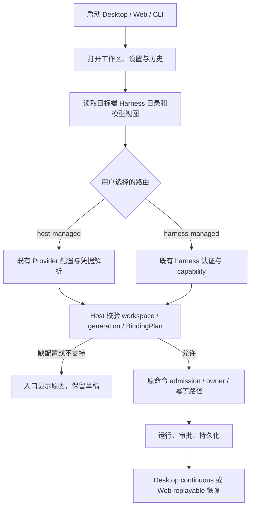

# 移除产品账号登录：实施计划

状态：P1 启动/UI 门禁解耦已落地（#20 一带）。P2 产品 OAuth / accountProvider / Coding Plan 服务装配拆除已落地（#27/#30 一带），见 `REMOVE-PRODUCT-LOGIN-P2.md`。P3 Web 浏览器 OAuth 栈（#33）、Desktop 产品 OAuth deeplink（#40）、CLI shared-credentials unload（#35）已落地；UI Root/Welcome OAuth shell（#37）、settings 登录/购买（#36）、toolbar（#38）、sidebar footer（#39）、SessionPane upgrade CTA（#42）、login/** deadcode、UsageRemainingPanel + StatusCards 文案、settings 停 upgrade、ChatErrorBanner + loginRecovery、PlatformChannels/IPlatformService OAuth 薄清（#47 一带 / tip `860c4de`）已落地。仍剩：Dialog / Provider / EntryGate / Root 整卸；CLI TUI `loginSetup`/API Key 挂点与 verify 脚本扩展。`loginRequired` 面板/帮助文案已改为「无模型→配 Provider」（不再推 `/login` Coding Plan）。

调研基线：`cursor/wave4-harness-integration-b7a9`，提交 `5ae4353`。本仓库定位为自用、开源的多 harness 工作台，不再要求登录 ZCode/Z.ai/BigModel 产品账号。

## 1. 完成后的使用方式

1. Desktop、Web、CLI/TUI 在没有产品账号、没有旧登录缓存时也能启动并访问工作区、设置和已有历史。
2. 用户选择 harness。对于已支持的 host-managed 路由，通过现有模型设置配置自己的 Provider、API endpoint、API Key 和模型；对于已支持的 harness-managed 路由，使用该 harness 自身的认证和模型配置。
3. 缺少可执行模型或 harness 凭据时，只在创建/发送入口提示具体缺项，提供模型设置或 harness 配置入口。不得重定向到产品登录页，不得默默切换默认模型或 harness。
4. 删除产品头像菜单中的登录/退出、连接 Z.ai/BigModel 账号、账号过期重登录和 Coding Plan 购买/团队组织入口。模型配置与“登录”彻底分离。
5. Z.ai/BigModel 等服务仍可作为普通 API Key Provider 使用。移除的是产品账号体系，不是特定模型厂商的 API 兼容性。

## 2. 删除边界

| 能力                                                                   | 处理规则                                                                       |
| ---------------------------------------------------------------------- | ------------------------------------------------------------------------------ |
| 产品 OAuth、授权轮询、用户资料、产品 JWT、账号退出/续期                | 删除入口、启动逻辑、服务装配和专属协议；停止相关后台网络请求                   |
| OAuth 派生的账号 Provider、团队组织、订阅/额度与购买 UI                | 撤出可执行模型目录并移除账号专属能力；历史中的 Provider/model 标识保留可读     |
| 用户显式配置的 API Key、endpoint、模型及参数                           | 保留现有存储、设置入口和模型执行器；不得随账号迁移被清空                       |
| Claude Code、Codex、Pi、ACP 等 harness 自身认证                        | 保留各 adapter 的认证和能力检查；是否可执行仍以当前注册目录与 support 结果为准 |
| MCP 插件自己的 OAuth/凭据                                              | 保留，不能用全仓库搜索 oauth 后批量删除的方式处理                              |
| SSH、Web 服务 token、WebSocket/RPC host capability、手机配对与连接授权 | 保留；移除产品登录不允许把受保护端点改成匿名访问                               |
| owner/lease、workspace identity/generation、命令幂等、待决审批         | 保留现有单一所有者及检查；本项目无需产品账号不等于工具可以无审批执行           |
| 商业云端分享、账号依赖的官方功能                                       | 按下文逐项关闭账号依赖路径；不伪造账号，不把产品 JWT 替换成 Provider API Key   |

不增加“默认已登录”假用户，不以永久跳过登录的开关作为最终实现，不保留空实现 OAuthService 维持旧依赖。

## 3. 已确认的代码入口

以下是调研入口，不是可直接整目录删除的清单。共享文件必须逐引用拆分，尤其是 deep link、网络客户端和 credential service。

| 层次              | 当前文件/目录                                                                                                                                                                                        | 需要处理的依赖                                                                                                                     |
| ----------------- | ---------------------------------------------------------------------------------------------------------------------------------------------------------------------------------------------------- | ---------------------------------------------------------------------------------------------------------------------------------- |
| 启动及登录 UI     | `packages/ui/src/Root.tsx`、`WelcomeScreen.tsx`、`login/LoginApiKeyForm.tsx`、`root/useProviderAvailabilityLoginEntryGuard.ts`                                                                       | Root 同时等待 OAuth 恢复、provider family 与模型视图；当前守卫会因缺少 providerFamilyDomain 或无用户且无可用 Provider 打开登录入口 |
| UI 账号状态       | `packages/ui/src/hooks/useOAuth.ts`、`hooks/useCredentials.ts`、`hooks/useTokenRefresh.ts`、`root/useRootOAuthEffects.ts`、`root/useRootWorkspaceActions.ts`、`store/`                               | 登录请求、缓存恢复、登出及 JWT 失效广播；需与普通工作区/模型状态拆开                                                               |
| 模型设置及商业 UI | `packages/ui/src/settings/ModelProviderSection.tsx`、`settings/model-provider-section/`、`settings/CodingPlanUpgradeDialog.tsx`、`chat-input-toolbar/`                                               | 登录动作、套餐状态、团队和额度入口；保留自定义 Provider 和普通模型选择                                                             |
| 服务与凭据        | `packages/services/src/oauth/`、`model-provider/accountRequestAuthService.ts`、`accountProviderCredentialService.ts`、`accountProviderRequestAuthService.ts`、`coding-plan-subscription/`、`node.ts` | OAuth、账号派生 API Key、账号 Provider resolution、过期回调与服务注册链                                                            |
| 模型层            | `packages/provider/src/account-provider-service.ts`、`account-provider-resolution.ts`、`packages/services/src/agent-host/modelBindingPlanner.ts`                                                     | 账号来源的模型与凭据投影；保留 Registry、BindingPlan 和 host-managed/harness-managed 的既有区分                                    |
| Desktop           | `packages/desktop/src/main/desktopOAuthDeepLink.ts`、`src/preload/oauthCallbackBridge.ts`、`src/main/index.ts`                                                                                       | 产品 OAuth state/callback/IPC。deep-link 文件也处理非登录链接，不可整文件删除                                                      |
| Web               | `packages/web/src/main.tsx`、`src/auth/webAuthService.ts`、`browserOAuthCredentialRepo.ts`、`WebCallbackPage.tsx`                                                                                    | 产品 OAuth callback、浏览器账号缓存，以及云分享入口对 WebAuthService 的依赖                                                        |
| CLI/TUI           | `apps/zcode-cli/packages/cli/src/login-command.ts`、`tui-login-state.ts`、`command-center/login-flow.ts`、`command-center/create.ts`、`apps/zcode-cli/packages/bootstrap/src/auth-login.ts`          | 产品 login/logout、登录轮询、TUI 登录门禁，以及目前藏在 /login 下的 API Key 配置                                                   |
| 跨进程契约        | `packages/services/src/index.ts`、`packages/client/src/remoteServiceAccess.ts`、`packages/shared/src/channels.ts`、`oauth.ts`、`account-provider-state.ts`、`platform.ts`                            | IOAuthService 与订阅服务导出、RPC 通道、平台回调和账号快照；同步变更消费者，保留第三方认证契约                                     |

CLI `apps/zcode-cli/packages/adapters/src/mcp/oauth*.ts`、运行 shell 的 login-shell 逻辑，以及 harness 自身认证不是本次删除目标。

## 4. 账号相关功能的明确处置

| 功能                                   | 本次移除后的行为                                                                                                                            |
| -------------------------------------- | ------------------------------------------------------------------------------------------------------------------------------------------- |
| Coding Plan 订阅、团队、购买、额度重置 | 删除产品账号专属 UI 和调用链；用户提供的普通 API Key 不受影响。仍可保留不依赖账号的本地使用量统计                                           |
| 官方闲时任务                           | 停止账号/票据依赖的派发入口；保留与其无关的本地自动化和正常前台任务，不把普通任务绑定到官方订阅                                             |
| 云端对话发布                           | `conversationShareService` 当前从 OAuth repo 获取 token。移除发布入口和账号客户端；保留本地历史、附件与已有本地导出能力，不新造匿名发布服务 |
| 插件目录与官方 MCP                     | 先按调用点确认：可匿名读取的公开目录及本地插件管理保留；需要产品账号的操作明确不可用并停止请求。第三方 MCP 自身的授权流程保留               |
| 手机/远程使用                          | 自部署 Web 与既有服务端 token/配对机制保留。如果某托管入口需要原产品 JWT，关闭该托管入口并解释限制；不移除原有连接鉴权来凑通路              |
| onboarding 与用户关联统计              | 去除产品 userId、账号恢复依赖，保留纯本地偏好/完成状态。是否进一步移除全部遥测不在此 PR 计划内                                              |
| 产品 API 请求 401                      | 不再触发全局“退出登录”或清空模型配置；Provider 401 归属具体 Provider，harness 认证错误归属具体 harness                                      |

公开目录、托管远控及官方 MCP 的匿名能力尚未逐接口验证。以上给出实施时的判断规则和不可用行为，不宣称这些远端服务已支持匿名访问。

## 5. 状态所有者与执行链

复用现有配置与服务，不引入第二套“无登录模式”状态。

| 事实                         | 唯一所有者                                                                                     | UI 职责                                                                      |
| ---------------------------- | ---------------------------------------------------------------------------------------------- | ---------------------------------------------------------------------------- |
| 用户模型配置及可执行视图     | 目标端现有 Provider Runtime/Registry，经 IProviderSettingsService、IModelSelectionService 访问 | 显示视图、编辑草稿和提交配置，不推断登录态或自行拼凭据                       |
| harness 是否支持和可执行     | 目标端 Harness Registry、adapter capability 与 ModelBindingPlanner                             | 展示 supported/unsupported/experimental/unknown 及原因，不因移除登录强行放行 |
| harness 自身认证材料         | 各 harness 已有认证所有者                                                                      | 只显示其公开状态和配置入口，不复制到产品 OAuth 仓库                          |
| 已接受任务、审批、重连恢复   | 既有 Host/CLI runtime、CommandInbox 与持久化记录                                               | 保留未提交草稿，读取同一 owner 的快照/事件                                   |
| 本地偏好和模型目录为空的提示 | 现有 setting service 与模型视图                                                                | 不再依赖 user、OAuth 恢复完成或 providerFamilyDomain                         |



空模型目录不阻塞应用启动；配置读取错误必须区别于“尚未配置”。目标切换后的迟到结果不能覆盖当前目标；保留现有 revision、owner/lease 和过期结果处理。网络离线时可读本地历史，不生成伪造的可执行状态。

## 6. 实施顺序与每阶段验收

所有实现阶段先更新涉及模块的 spec/contract，并按 `.agents/skills/architecture-governance/SKILL.md` 生成受控上下文。以下按依赖顺序记录各阶段范围；落地进度见文首状态，未勾选项仍待做。

### P1：启动和个人模型配置解耦

- 从 Root 启动条件移除产品 user、OAuth restore 和 providerFamilyDomain 的门禁；仍保留真正的数据加载/迁移错误提示。
- 将 LoginApiKeyForm 中可复用的个人模型配置能力移入现有模型设置；提供自定义 endpoint、模型和 Key 入口，不仅限两家官方服务。
- 替换账号入口为“模型与 Harness 设置”，移除登录/退出、过期重登录及套餐购买按钮。缺模型只限制需要它的发送动作。
- 验收：全新数据目录且无网络能打开工作区/历史/设置；配置 AxonHub、StepFun 等自选 Provider 后无需产品账号即可发起受支持任务。

### P2：服务装配和账号派生能力拆除

- 先逐项处理第 4 节功能的消费者，再移除 OAuthService、账号 Provider 凭据解析和 Coding Plan 专属装配、导出及后台刷新。
- 保留通用 credential service、个人 Provider 配置、网络代理/CA 配置和模型执行器；账号派生凭据不再注入执行环境。
- 删除全局 JWT 失效 → logout → 重登录链路；模型/harness 错误局部显示，不中止其他 Provider 的任务。
- 验收：空闲启动、重开和 Provider 401 都不会触发原产品授权/续期/账户/套餐请求；可用的个人 Provider 和 harness-managed 路由仍通过原能力校验执行。

### P3：Desktop、Web 和 CLI 入口收口

- 移除产品 OAuth 的 preload/main/renderer 回调、state 注册和授权轮询；保留文件/工作区等非登录 deep link。
- 移除 Web 产品 OAuth 页面与缓存恢复，并处理其云分享消费者；保持现有服务器 token、host capability 与配对验证。
- 删除 CLI 产品 login/logout 和 TUI 登录门禁；把旧 /login 下的 API Key 配置导向既有 Provider 配置机制。若需要新命令，先单独定义命令契约，不把尚不存在的命令写成可用说明。
- 旧产品 login 命令返回明确的“该功能已移除，请配置模型”错误，不打开浏览器、不写 token、不假报成功。
- 验收：Desktop/Web/CLI 都能无产品账号启动；非登录 deep link、第三方 MCP OAuth 与 harness 自身认证仍可使用。

### P4：存量配置与协议兼容

- 迁移只改产品账号相关元数据/可用性，保留用户个人 API Key、endpoint、模型顺序、项目、会话、worktree、历史及未决任务事实。
- 默认不自动擦除旧 OAuth 凭据；新版本不再读取或使用它们，允许后续单独清理。共享 credential store 禁止整体删除。
- 旧账号 Provider 对应历史继续显示原模型身份；新发送提示改配 Provider，不自动复制派生 Key 或切换模型。持久化 schema 确需变化时增加显式版本迁移与幂等测试。
- 协议字段只为旧历史解码保留兼容读取；新写入不再生成产品 account 认证路径。删 RPC 服务时同步改 Host/client/renderer/CLI，必要时更新能力/版本协商；旧端组合明确报不兼容，不能降级为匿名。
- 验收：连续迁移两次结果一致；Key、项目和历史不丢；旧账号过期不会清空个人 Provider 或重置运行任务。使用隔离副本验证，禁止拿真实凭据做 fixture。

### P5：清理、回归和发布说明

- 清理废弃导出、依赖、国际化字符串、test IDs、平台接口、说明和示例；不按 auth/oauth/login 关键词盲删第三方认证或 login shell。`PlatformChannels.OAuth*` 与 `IPlatformService.registerOAuthState`/`onOAuthCallback` 已薄清（#47 一带 / tip `860c4de`）；`oauth.ts` 领域类型仍保留。
- 检查 Desktop、Web、CLI 构建、入口网络行为，以及下列验收矩阵；记录每个用例的 pass/fail/blocked，不以 skip 代替实机证据。
- 发布说明列出账号功能移除、自有模型配置方式、旧配置处理和不再提供的托管功能。保留本地数据以支持回退，不承诺旧版可读未经验证的新 schema。

## 7. 验收矩阵

| 场景                                                      | 必须看到的结果                                                                                   |
| --------------------------------------------------------- | ------------------------------------------------------------------------------------------------ |
| 全新安装，无任何账号/Provider                             | 直接进工作区；能打开设置/历史；需要模型的动作解释缺项，不弹产品登录                              |
| 已配置自有 API Key，但没有 providerFamilyDomain/user      | 正常显示模型并执行任务；配置错误不伪装为“需要登录”                                               |
| 无产品账号，选择受支持的 harness-managed 路由             | 仅由 harness 自身认证及 capability 决定；缺凭据说明所属 harness                                  |
| Provider 401/网络失败                                     | 仅影响相关请求，其他 Provider、工作区、历史不被清空                                              |
| 历史含过期产品账号 Provider                               | 历史可读，新执行明确要求改配；不自动换模型、不再续期旧产品 token                                 |
| 两个目标使用相同路径或不同 Provider                       | 仍由正确 target/workspace identity 解析配置和凭据；不存在跨目标写入/泄露                         |
| 有待决审批或长任务时关窗口、Quit、重连                    | 同一 owner/command/request，任务不误完成、不重发，审批不自动允许或拒绝                           |
| MCP OAuth、harness 原生认证                               | 可以按各自原契约授权/续期，不能被产品登录移除误伤                                                |
| 未授权 WebSocket、无效 server token/配对、陈旧 generation | 继续被拒绝，不因“无登录”绕过保护                                                                 |
| 旧 OAuth callback/旧 CLI login                            | 给出安全明确的移除反馈；不把不可信回调转发到任意窗口                                             |
| 启动与空闲网络观察                                        | 没有产品账号授权、轮询、token refresh、套餐/账号身份派生请求；用户触发的模型或第三方认证另行归属 |

实际实机验收至少覆盖 macOS Desktop 与真实自配 Provider；Web/CLI 入口另做 E2E。其他 harness/平台按当前能力矩阵验证，不把“注册成功”当作实际执行认证通过。

## 8. 验证入口与本计划 PR 的结果

实现时必须执行根目录 `pnpm typecheck`、`pnpm lint` 和 `pnpm architecture:check --changed`。CLI 改动另跑 `pnpm --dir apps/zcode-cli typecheck`、`pnpm --dir apps/zcode-cli lint`，并实际构建 Desktop Agent/桌面包、Web 与相关 server 包；根 typecheck 不代表 CLI 或发行包构建通过。

可复用的现有回归入口（按实际改动选择；下列不是本 PR 已执行的测试）：

```sh
pnpm exec tsx --test \
  packages/services/test/providerConfigMigration.test.ts \
  packages/services/test/modelBindingPlanner.test.ts \
  packages/services/test/agentHostHarnessManagedAdmission.test.ts \
  packages/services/test/modelGatewayBindingPlan.test.ts
```

另补启动无账号、个人模型配置、账户状态退休迁移、401 不触发全局登出、Web token 拒绝路径与 CLI 无登录入口测试；UI 使用既有浏览器 fixture/实际桌面流程，不虚构统一 `pnpm test` 或已通过的 E2E。

本 PR 为纯计划文档，2026-09-28 在上述基线上实际检查：

- `pnpm typecheck`：通过，退出码 0。
- `pnpm lint`：失败，84 warnings / 3 errors；均为已有 `max-lines`：`packages/server/src/remote/connect.ts`（538 行）、`packages/ui/src/project-sidebar/ProjectSidebarAgentCreateForm.tsx`（459 行）、`packages/services/src/agent-adapters/claude/claudeHarnessAdapter.ts`（583 行）。
- 本计划文档初次合入时尚未改登录代码；后续 P1–P4 入口/UI 拆除进度见文首状态。验收矩阵仍须按实机补齐，不能仅凭文档或 guard 常量宣称完成。

完成标准：P1–P5 的账号调用链真正退出产品，保留能力的回归及真实恢复场景有证据，文档与可运行入口一致。不能只删欢迎页或把 guard 常量改成 false 就宣布完成。
