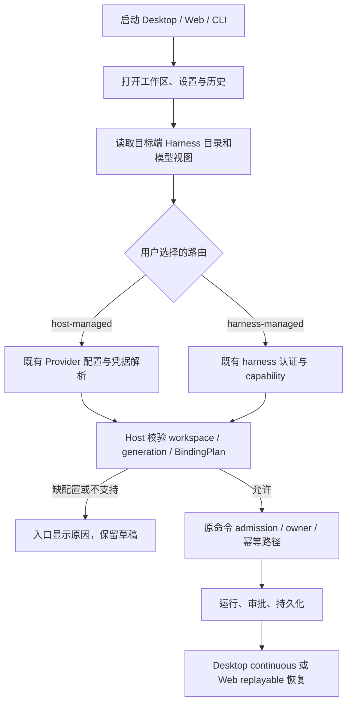

# 移除产品账号登录：实施计划

状态（2026-09-29）：P1–P4 的主要源码已落地：启动/Welcome 门禁、产品 OAuth 装配、Web/Desktop 回调、CLI 产品登录和旧账号凭据读者已移除，个人 Provider、MCP OAuth 与 harness 自身认证保留。源码移除 gate 与局部契约测试不代表完整应用验收。

剩余工作统一进入 [总体交付计划 M3](../PROJECT-DELIVERY-PLAN.md)：新安装/升级、个人 Key 与历史无损、无产品账号网络请求、第三方认证、Web/CLI/Desktop E2E。保留能力（个人 Key、MCP OAuth、harness 自身认证、离线历史）的现有测试证据与缺口见 [第 9 节](#9-m3-保留能力证据对表)。原逐 PR 台账在 `archive/2026-09-29/integration-before-consolidation` 标签的本文件历史中保留；不再为 tip 编号更新单独发 PR。

本文件保留移除范围和实施设计，下面的“代码入口”是原始调研定位，可能已经删除；当前实现入口见 [实现导航](../agent-host/IMPLEMENTATION.md)。下半部分的 2026-09-28 类型/lint 结果是原计划 PR 的历史结果，不能充当当前集成版本验收。

调研基线：`cursor/wave4-harness-integration-b7a9`，提交 `5ae4353`。本仓库定位为自用、开源的多 harness 工作台，不再要求登录 ZCode/Z.ai/BigModel 产品账号。

## 1. 完成后的使用方式

1. Desktop、Web、CLI/TUI 在没有产品账号、没有旧登录缓存时也能启动并访问工作区、设置和已有历史。
2. 用户选择 harness。对于已支持的 host-managed 路由，通过现有模型设置配置自己的 Provider、API endpoint、API Key 和模型；对于已支持的 harness-managed 路由，使用该 harness 自身的认证和模型配置。
3. 缺少可执行模型或 harness 凭据时，只在创建/发送入口提示具体缺项，提供模型设置或 harness 配置入口。不得重定向到产品登录页，不得默默切换默认模型或 harness。
4. 删除产品头像菜单中的登录/退出、连接 Z.ai/BigModel 账号、账号过期重登录和 Coding Plan 购买/团队组织入口。模型配置与“登录”彻底分离。
5. Z.ai/BigModel 等服务仍可作为普通 API Key Provider 使用。移除的是产品账号体系，不是特定模型厂商的 API 兼容性。

## 2. 删除边界

| 能力                                                                   | 处理规则                                                                       |
| ---------------------------------------------------------------------- | ------------------------------------------------------------------------------ |
| 产品 OAuth、授权轮询、用户资料、产品 JWT、账号退出/续期                | 删除入口、启动逻辑、服务装配和专属协议；停止相关后台网络请求                   |
| OAuth 派生的账号 Provider、团队组织、订阅/额度与购买 UI                | 撤出可执行模型目录并移除账号专属能力；历史中的 Provider/model 标识保留可读     |
| 用户显式配置的 API Key、endpoint、模型及参数                           | 保留现有存储、设置入口和模型执行器；不得随账号迁移被清空                       |
| Claude Code、Codex、Pi、ACP 等 harness 自身认证                        | 保留各 adapter 的认证和能力检查；是否可执行仍以当前注册目录与 support 结果为准 |
| MCP 插件自己的 OAuth/凭据                                              | 保留，不能用全仓库搜索 oauth 后批量删除的方式处理                              |
| SSH、Web 服务 token、WebSocket/RPC host capability、手机配对与连接授权 | 保留；移除产品登录不允许把受保护端点改成匿名访问                               |
| owner/lease、workspace identity/generation、命令幂等、待决审批         | 保留现有单一所有者及检查；本项目无需产品账号不等于工具可以无审批执行           |
| 商业云端分享、账号依赖的官方功能                                       | 按下文逐项关闭账号依赖路径；不伪造账号，不把产品 JWT 替换成 Provider API Key   |

不增加“默认已登录”假用户，不以永久跳过登录的开关作为最终实现，不保留空实现 OAuthService 维持旧依赖。

## 3. 已确认的代码入口

以下是调研入口，不是可直接整目录删除的清单。共享文件必须逐引用拆分，尤其是 deep link、网络客户端和 credential service。

| 层次              | 当前文件/目录                                                                                                                                                                                        | 需要处理的依赖                                                                                                                     |
| ----------------- | ---------------------------------------------------------------------------------------------------------------------------------------------------------------------------------------------------- | ---------------------------------------------------------------------------------------------------------------------------------- |
| 启动及登录 UI     | `packages/ui/src/Root.tsx`、`WelcomeScreen.tsx`、`login/LoginApiKeyForm.tsx`、`root/useProviderAvailabilityLoginEntryGuard.ts`                                                                       | Root 同时等待 OAuth 恢复、provider family 与模型视图；当前守卫会因缺少 providerFamilyDomain 或无用户且无可用 Provider 打开登录入口 |
| UI 账号状态       | `packages/ui/src/hooks/useOAuth.ts`、`hooks/useCredentials.ts`、`hooks/useTokenRefresh.ts`、`root/useRootOAuthEffects.ts`、`root/useRootWorkspaceActions.ts`、`store/`                               | 登录请求、缓存恢复、登出及 JWT 失效广播；需与普通工作区/模型状态拆开                                                               |
| 模型设置及商业 UI | `packages/ui/src/settings/ModelProviderSection.tsx`、`settings/model-provider-section/`、`chat-input-toolbar/`（`CodingPlanUpgradeDialog*` 已整卸，见文首）                                          | 原登录/套餐购买入口已拆除；保留自定义 Provider 和普通模型选择                                                                      |
| 服务与凭据        | `packages/services/src/oauth/`、`model-provider/accountRequestAuthService.ts`、`accountProviderCredentialService.ts`、`accountProviderRequestAuthService.ts`、`coding-plan-subscription/`、`node.ts` | OAuth、账号派生 API Key、账号 Provider resolution、过期回调与服务注册链                                                            |
| 模型层            | `packages/provider/src/account-provider-service.ts`、`account-provider-resolution.ts`、`packages/services/src/agent-host/modelBindingPlanner.ts`                                                     | 账号来源的模型与凭据投影；保留 Registry、BindingPlan 和 host-managed/harness-managed 的既有区分                                    |
| Desktop           | `packages/desktop/src/main/desktopOAuthDeepLink.ts`、`src/preload/oauthCallbackBridge.ts`、`src/main/index.ts`                                                                                       | 产品 OAuth state/callback/IPC。deep-link 文件也处理非登录链接，不可整文件删除                                                      |
| Web               | `packages/web/src/main.tsx`、`src/auth/webAuthService.ts`、`browserOAuthCredentialRepo.ts`、`WebCallbackPage.tsx`                                                                                    | 产品 OAuth callback、浏览器账号缓存，以及云分享入口对 WebAuthService 的依赖                                                        |
| CLI/TUI           | `apps/zcode-cli/packages/cli/src/login-command.ts`、`tui-login-state.ts`、`command-center/login-flow.ts`、`command-center/create.ts`、`apps/zcode-cli/packages/bootstrap/src/auth-login.ts`          | 产品 login/logout、登录轮询、TUI 登录门禁，以及目前藏在 /login 下的 API Key 配置                                                   |
| 跨进程契约        | `packages/services/src/index.ts`、`packages/client/src/remoteServiceAccess.ts`、`packages/shared/src/channels.ts`、`oauth.ts`、`account-provider-state.ts`、`platform.ts`                            | IOAuthService 与订阅服务导出、RPC 通道、平台回调和账号快照；同步变更消费者，保留第三方认证契约                                     |

CLI `apps/zcode-cli/packages/adapters/src/mcp/oauth*.ts`、运行 shell 的 login-shell 逻辑，以及 harness 自身认证不是本次删除目标。

## 4. 账号相关功能的明确处置

| 功能                                   | 本次移除后的行为                                                                                                                            |
| -------------------------------------- | ------------------------------------------------------------------------------------------------------------------------------------------- |
| Coding Plan 订阅、团队、购买、额度重置 | 删除产品账号专属 UI 和调用链；用户提供的普通 API Key 不受影响。仍可保留不依赖账号的本地使用量统计                                           |
| 官方闲时任务                           | 停止账号/票据依赖的派发入口；保留与其无关的本地自动化和正常前台任务，不把普通任务绑定到官方订阅                                             |
| 云端对话发布                           | `conversationShareService` 当前从 OAuth repo 获取 token。移除发布入口和账号客户端；保留本地历史、附件与已有本地导出能力，不新造匿名发布服务 |
| 插件目录与官方 MCP                     | 先按调用点确认：可匿名读取的公开目录及本地插件管理保留；需要产品账号的操作明确不可用并停止请求。第三方 MCP 自身的授权流程保留               |
| 手机/远程使用                          | 自部署 Web 与既有服务端 token/配对机制保留。如果某托管入口需要原产品 JWT，关闭该托管入口并解释限制；不移除原有连接鉴权来凑通路              |
| onboarding 与用户关联统计              | 去除产品 userId、账号恢复依赖，保留纯本地偏好/完成状态。是否进一步移除全部遥测不在此 PR 计划内                                              |
| 产品 API 请求 401                      | 不再触发全局“退出登录”或清空模型配置；Provider 401 归属具体 Provider，harness 认证错误归属具体 harness                                      |

公开目录、托管远控及官方 MCP 的匿名能力尚未逐接口验证。以上给出实施时的判断规则和不可用行为，不宣称这些远端服务已支持匿名访问。

## 5. 状态所有者与执行链

复用现有配置与服务，不引入第二套“无登录模式”状态。

| 事实                         | 唯一所有者                                                                                     | UI 职责                                                                      |
| ---------------------------- | ---------------------------------------------------------------------------------------------- | ---------------------------------------------------------------------------- |
| 用户模型配置及可执行视图     | 目标端现有 Provider Runtime/Registry，经 IProviderSettingsService、IModelSelectionService 访问 | 显示视图、编辑草稿和提交配置，不推断登录态或自行拼凭据                       |
| harness 是否支持和可执行     | 目标端 Harness Registry、adapter capability 与 ModelBindingPlanner                             | 展示 supported/unsupported/experimental/unknown 及原因，不因移除登录强行放行 |
| harness 自身认证材料         | 各 harness 已有认证所有者                                                                      | 只显示其公开状态和配置入口，不复制到产品 OAuth 仓库                          |
| 已接受任务、审批、重连恢复   | 既有 Host/CLI runtime、CommandInbox 与持久化记录                                               | 保留未提交草稿，读取同一 owner 的快照/事件                                   |
| 本地偏好和模型目录为空的提示 | 现有 setting service 与模型视图                                                                | 不再依赖 user、OAuth 恢复完成或 providerFamilyDomain                         |



空模型目录不阻塞应用启动；配置读取错误必须区别于“尚未配置”。目标切换后的迟到结果不能覆盖当前目标；保留现有 revision、owner/lease 和过期结果处理。网络离线时可读本地历史，不生成伪造的可执行状态。

## 6. 实施顺序与每阶段验收

所有实现阶段先更新涉及模块的 spec/contract，并按 `.agents/skills/architecture-governance/SKILL.md` 生成受控上下文。以下按依赖顺序记录各阶段范围；落地进度见文首状态，未勾选项仍待做。

### P1：启动和个人模型配置解耦

- 从 Root 启动条件移除产品 user、OAuth restore 和 providerFamilyDomain 的门禁；仍保留真正的数据加载/迁移错误提示。
- 将 LoginApiKeyForm 中可复用的个人模型配置能力移入现有模型设置；提供自定义 endpoint、模型和 Key 入口，不仅限两家官方服务。
- 替换账号入口为“模型与 Harness 设置”，移除登录/退出、过期重登录及套餐购买按钮。缺模型只限制需要它的发送动作。
- 验收：全新数据目录且无网络能打开工作区/历史/设置；配置 AxonHub、StepFun 等自选 Provider 后无需产品账号即可发起受支持任务。

### P2：服务装配和账号派生能力拆除

- 先逐项处理第 4 节功能的消费者，再移除 OAuthService、账号 Provider 凭据解析和 Coding Plan 专属装配、导出及后台刷新。
- 保留通用 credential service、个人 Provider 配置、网络代理/CA 配置和模型执行器；账号派生凭据不再注入执行环境。
- 删除全局 JWT 失效 → logout → 重登录链路；模型/harness 错误局部显示，不中止其他 Provider 的任务。
- 验收：空闲启动、重开和 Provider 401 都不会触发原产品授权/续期/账户/套餐请求；可用的个人 Provider 和 harness-managed 路由仍通过原能力校验执行。

### P3：Desktop、Web 和 CLI 入口收口

- 移除产品 OAuth 的 preload/main/renderer 回调、state 注册和授权轮询；保留文件/工作区等非登录 deep link。
- 移除 Web 产品 OAuth 页面与缓存恢复，并处理其云分享消费者；保持现有服务器 token、host capability 与配对验证。
- 删除 CLI 产品 login/logout 和 TUI 登录门禁；把旧 /login 下的 API Key 配置导向既有 Provider 配置机制。若需要新命令，先单独定义命令契约，不把尚不存在的命令写成可用说明。
- 旧产品 login 命令返回明确的“该功能已移除，请配置模型”错误，不打开浏览器、不写 token、不假报成功。
- 验收：Desktop/Web/CLI 都能无产品账号启动；非登录 deep link、第三方 MCP OAuth 与 harness 自身认证仍可使用。

### P4：存量配置与协议兼容

- 迁移只改产品账号相关元数据/可用性，保留用户个人 API Key、endpoint、模型顺序、项目、会话、worktree、历史及未决任务事实。
- 默认不自动擦除旧 OAuth 凭据；新版本不再读取或使用它们，允许后续单独清理。共享 credential store 禁止整体删除。
- 旧账号 Provider 对应历史继续显示原模型身份；新发送提示改配 Provider，不自动复制派生 Key 或切换模型。持久化 schema 确需变化时增加显式版本迁移与幂等测试。
- 协议字段只为旧历史解码保留兼容读取；新写入不再生成产品 account 认证路径。删 RPC 服务时同步改 Host/client/renderer/CLI，必要时更新能力/版本协商；旧端组合明确报不兼容，不能降级为匿名。
- 验收：连续迁移两次结果一致；Key、项目和历史不丢；旧账号过期不会清空个人 Provider 或重置运行任务。使用隔离副本验证，禁止拿真实凭据做 fixture。

### P5：清理、回归和发布说明

- 清理废弃导出、依赖、国际化字符串、test IDs、平台接口、说明和示例；不按 auth/oauth/login 关键词盲删第三方认证或 login shell。`PlatformChannels.OAuth*` 与 `IPlatformService.registerOAuthState`/`onOAuthCallback` 已薄清（#47 一带）；`CodingPlanUpgradeDialog`/`Provider` 与 Root wrap 已卸（`9ce3088`）；`oauth.ts` 领域类型残留仍保留待清；Root/`store` `isRestoringOAuthSession` 已卸。
- 检查 Desktop、Web、CLI 构建、入口网络行为，以及下列验收矩阵；记录每个用例的 pass/fail/blocked，不以 skip 代替实机证据。
- 发布说明列出账号功能移除、自有模型配置方式、旧配置处理和不再提供的托管功能。保留本地数据以支持回退，不承诺旧版可读未经验证的新 schema。

## 7. 验收矩阵

| 场景                                                      | 必须看到的结果                                                                                   |
| --------------------------------------------------------- | ------------------------------------------------------------------------------------------------ |
| 全新安装，无任何账号/Provider                             | 直接进工作区；能打开设置/历史；需要模型的动作解释缺项，不弹产品登录                              |
| 已配置自有 API Key，但没有 providerFamilyDomain/user      | 正常显示模型并执行任务；配置错误不伪装为“需要登录”                                               |
| 无产品账号，选择受支持的 harness-managed 路由             | 仅由 harness 自身认证及 capability 决定；缺凭据说明所属 harness                                  |
| Provider 401/网络失败                                     | 仅影响相关请求，其他 Provider、工作区、历史不被清空                                              |
| 历史含过期产品账号 Provider                               | 历史可读，新执行明确要求改配；不自动换模型、不再续期旧产品 token                                 |
| 两个目标使用相同路径或不同 Provider                       | 仍由正确 target/workspace identity 解析配置和凭据；不存在跨目标写入/泄露                         |
| 有待决审批或长任务时关窗口、Quit、重连                    | 同一 owner/command/request，任务不误完成、不重发，审批不自动允许或拒绝                           |
| MCP OAuth、harness 原生认证                               | 可以按各自原契约授权/续期，不能被产品登录移除误伤                                                |
| 未授权 WebSocket、无效 server token/配对、陈旧 generation | 继续被拒绝，不因“无登录”绕过保护                                                                 |
| 旧 OAuth callback/旧 CLI login                            | 给出安全明确的移除反馈；不把不可信回调转发到任意窗口                                             |
| 启动与空闲网络观察                                        | 没有产品账号授权、轮询、token refresh、套餐/账号身份派生请求；用户触发的模型或第三方认证另行归属 |

实际实机验收至少覆盖 macOS Desktop 与真实自配 Provider；Web/CLI 入口另做 E2E。其他 harness/平台按当前能力矩阵验证，不把“注册成功”当作实际执行认证通过。

## 8. 验证入口与本计划 PR 的结果

实现时必须执行根目录 `pnpm typecheck`、`pnpm lint` 和 `pnpm architecture:check --changed`。CLI 改动另跑 `pnpm --dir apps/zcode-cli typecheck`、`pnpm --dir apps/zcode-cli lint`，并实际构建 Desktop Agent/桌面包、Web 与相关 server 包；根 typecheck 不代表 CLI 或发行包构建通过。

可复用的现有回归入口（按实际改动选择；下列不是本 PR 已执行的测试）：

```sh
pnpm exec tsx --test \
  packages/services/test/providerConfigMigration.test.ts \
  packages/services/test/modelBindingPlanner.test.ts \
  packages/services/test/agentHostHarnessManagedAdmission.test.ts \
  packages/services/test/modelGatewayBindingPlan.test.ts
```

另补启动无账号、个人模型配置、账户状态退休迁移、401 不触发全局登出、Web token 拒绝路径与 CLI 无登录入口测试；UI 使用既有浏览器 fixture/实际桌面流程，不虚构统一 `pnpm test` 或已通过的 E2E。

本 PR 为纯计划文档，2026-09-28 在上述基线上实际检查：

- `pnpm typecheck`：通过，退出码 0。
- `pnpm lint`：失败，84 warnings / 3 errors；均为已有 `max-lines`：`packages/server/src/remote/connect.ts`（538 行）、`packages/ui/src/project-sidebar/ProjectSidebarAgentCreateForm.tsx`（459 行）、`packages/services/src/agent-adapters/claude/claudeHarnessAdapter.ts`（583 行）。
- 本计划文档初次合入时尚未改登录代码；后续 P1–P4 入口/UI 拆除进度见文首状态。验收矩阵仍须按实机补齐，不能仅凭文档或 guard 常量宣称完成。

完成标准：P1–P5 的账号调用链真正退出产品，保留能力的回归及真实恢复场景有证据，文档与可运行入口一致。不能只删欢迎页或把 guard 常量改成 false 就宣布完成。

## 9. M3 保留能力证据对表

盘点：2026-09-30，首版基于集成线 tip `0ab129e`，本次同步到 `d60395e`（`7030628` 之后含 #320 MCP OAuth 行为测试、#321 迁移幂等与个人 Key 端到端、#325 失效 Provider 不静默回退、#328 401 / 失效绑定的类型化“需要改配”错误、#332/#334 准入层凭据需处理状态、#342 本节离线启动 / 空闲网络观察测试、#343 lazy Host 冷读 capability 报告凭据需处理、#344 UI“需要重新配置 Provider”提示、#346 RPC 过线保留错误 `code`、#347 Claude 单元测试与 `session.error` 消息截断到 1024、#348 共享模型失败分类器、#349 send 回执与 `lastError` 携带类型化失败、#350 Pi worker 拆分（行为不变的重构，Pi worker 改为引用共享的 `toProviderReconfigureFailure`）、#351 类型化失败经 `@zcode/rpc` 远端 target 的端到端测试与 `persistentTargetClient` Initialize 竞态修复、#354 AI SDK 流错误日志脱敏、#356 Desktop ack 保留类型化失败且提示按 `failure.providerId` 命名，以及本轮 gap 6 两项修复：ZCode Built-in 配置检查按是否在用门控、off-peak 同步失败同一任务只 warn 一次；同区间的 #322–#324、#326、#327、#329–#331、#333、#335、#336、#338–#341、#345 是 Host 能力引导鉴权、票据消费与绑定、`/ws/host` 与本地端点头校验、`/api/server-info` 瘦身、投影 / 迟到事件 / 断流关闭 / 延迟释放 / 活动侧车修复 / 关闭后类型化错误与 create 失败释放 host、Supervisor 版本错位引导、构建依赖、全仓 oxfmt 格式化与模块拆分、`/api/connect-remote` 头与 JSON 校验；#352 是 Claude 启动 launchProcess hook 与 A7–A11 单元测试，#353 让 `#releaseSendReservation` 在关闭后不再写侧车、close 等待这次释放写入，#355 经 `#persistActivityWhileOpen` 再修 4 处关闭后写侧车，#357 是 Claude A14–A16（grant / 绑定检查、`ClaudeBindingMismatchError`、重开失效 Provider）及其测试，#358 是 close / send 竞态修复，#360 是 provider 测试夹具共用 Registry + Pi host 接线（`staleProviderReconfigureNoFallback.test.ts` 改用共享夹具，仍 8 条），也不改变本表；之后的 #361（`f840fb1`）只重排 `runner-stream.ts` 格式，本节未在其上重跑）。这是证据清单，不是 M3 完成声明。证据等级沿用 [总体交付计划 §5](../PROJECT-DELIVERY-PLAN.md#5-验收矩阵和证据等级)：**源码存在 → 确定性测试 → 标准构建 → 真实环境**。下表“确定性测试”区分行为测试（真正调用实现）与源码扫描 pin（`readFileSync` 断言文件/符号存在或缺席）；后者只证明源码形态，不证明运行行为。所有条目当前最高只到确定性测试，没有标准构建或真实环境证据。

### 9.1 对表

| 保留入口                                 | 主要代码位置                                                                                                                                                                                                                                                                                                          | 现有测试证据                                                                                                                                                                                                                                                                                                                                                                                                                                                                                                                                                                                                                                                                                                                                                                                                                                                                                                                                                                                                                                                                                                                                                                                                                                                                                                                                                                                                                                                                                                                                                                                                                                                                                                                                                                                                                            | 最高等级                                       |
| ---------------------------------------- | --------------------------------------------------------------------------------------------------------------------------------------------------------------------------------------------------------------------------------------------------------------------------------------------------------------------- | --------------------------------------------------------------------------------------------------------------------------------------------------------------------------------------------------------------------------------------------------------------------------------------------------------------------------------------------------------------------------------------------------------------------------------------------------------------------------------------------------------------------------------------------------------------------------------------------------------------------------------------------------------------------------------------------------------------------------------------------------------------------------------------------------------------------------------------------------------------------------------------------------------------------------------------------------------------------------------------------------------------------------------------------------------------------------------------------------------------------------------------------------------------------------------------------------------------------------------------------------------------------------------------------------------------------------------------------------------------------------------------------------------------------------------------------------------------------------------------------------------------------------------------------------------------------------------------------------------------------------------------------------------------------------------------------------------------------------------------------------------------------------------------------------------------------------------------- | ---------------------------------------------- |
| 个人 Provider（API Key、endpoint、模型） | `packages/services/src/model-provider/providerConfigRuntime.ts`、`legacyZCodeConfigProviderReader.ts`；UI `packages/ui/src/settings/ModelProviderSection.tsx`                                                                                                                                                         | 行为：`packages/services/test/providerConfigMigration.test.ts` 3 条（迁移不改源文件、已有个人配置不被旧文件覆盖、坏旧配置保留且不写空配置）；`legacyProductOauthCredentialUnload.test.ts` 6 条（读者不加载产品 OAuth 键；provisioning 同步忽略残留 OAuth 键且不擦除凭据库等）；`packages/ui/test/productLoginStartup.test.ts` 的“personal provider setup accepts a non-official endpoint, key, and model”“rejects a blank model without implying login”；`modelBindingPlanner.test.ts`“host-managed plan freezes route, models, capabilities, credential ref and fingerprint”；`piControlPlane.test.ts`“host-managed prompts … never carry a provider URL or key”。`provider401IsolationAndExpiredHistory.test.ts`（#318）“Provider 401 is scoped to A while B/C remain usable sequentially and concurrently”（真实 `AiSdkModelAdapter` 对本地 HTTP fake）。`m3Gap5MigrationAndPersonalKey.test.ts`（#321）3 条：旧个人 Key 迁移连跑两次幂等且保留用户改动与密钥；迁移中断、个人文件缺失后重跑不产生重复；个人 Key 录入 → 落盘 → 重载进 registry → 真实调用本地 fake，Key 在请求里、不在日志与状态事件里。`staleProviderReconfigureNoFallback.test.ts`（#325，#328、#332、#334 更新）8 条：Provider 被删 / Key 过期 401 时只拒绝或只打绑定的 Provider，不回退到其他 Provider，改配后只执行用户的新选择，并断言类型化的“需要改配”错误；401 之后同一 Provider 的新一轮在发请求前被拒、其他 Provider 不受影响、改配后清除；send 回执的 `failure` 严格校验；403 与可重试失败不标记；只标记出 401 的 Provider，capability 提前报告，attach / create 仍可用；`piModelFailurePropagation.test.ts`（#328）5 条：Pi 模型桥转发脱敏的类型化 401 失败且不带 Key、未分类错误保持旧的无原因失败、`session.error.failure` 严格校验。源码扫描：`removeProductLoginP2.contract.test.ts`“personal credential and provider runtime stay in node assembly” | 确定性测试                                     |
| MCP OAuth                                | `apps/zcode-cli/packages/adapters/src/mcp/oauth*.ts`（8 个文件）、`packages/shared/src/official-mcp-auth.ts`                                                                                                                                                                                                          | 行为：`apps/zcode-cli/packages/adapters/src/mcp/oauth-behavior.test.ts` 10 条，进程内 fake 授权服务器（127.0.0.1）+ 临时凭据文件，真实走 discovery → DCR → authorize（PKCE S256、state）→ code exchange：授权后发布 canonical pair 且带 refresh token；伪造 state 的回调被 400 忽略、真回调仍完成；临期 `token()` 主动刷新并轮换 refresh token、换代；`onUnauthorized` 被动刷新；两个 store 实例并发刷新只打一次 token 端点；`invalid_grant`（撤销）清 token、保留 client、之后 `token()` 为空并可重新授权恢复；DCR client 的 `invalid_client` 整对清除，静态 clientId 报配置错误且不清凭据；AS 503 时主动刷新保留现值、被动刷新报临时错误且不失效。每条都校验旧产品登录键（`LEGACY_PRODUCT_OAUTH_CREDENTIAL_KEYS`）在同一凭据文件里原样保留，凭据文件只新增 `mcp:oauth:*` 键。保留 pin：`scripts/product-login-checks/refactor.test.mjs` 的“preserve MCP OAuth”夹具；`packages/shared/test/productLoginPurchaseResidualsAbsentEx3.test.mjs`“KEEP … mcp-auth …”；`scripts/product-login-checks/shared-contracts.mjs` 保留 MCP slash help                                                                                                                                                                                                                                                                                                                                                                                                                                                                                                                                                                                                                                                                                                                                                                                                | 确定性测试（fake 授权服务器）                  |
| harness 自身认证                         | `packages/services/src/agent-adapters/{codex,claude,claude-code,pi}/`、`agent-adapters` ACP profile、`packages/services/src/model-gateway/`                                                                                                                                                                           | Codex：`codexHarness.control.test.ts`“fake app-server covers events, isolation, and refuses global Codex config”（用户 `auth.json` 原样保留，token 不进受管配置）。Claude Code：`claudeCodeControlPlane.test.ts`“profile writes stay out of the user Claude login directory”“ACP transport delivers control events without credentials”。Pi：`agentHostHarnessManagedAdmission.test.ts`“Pi rejects its unsupported native-account mode before a worker or journal is created”；`piControlPlane.test.ts`“harness-managed does not claim unified routing, and a secret credential ref is dropped”。ACP（OpenCode 等）：`acpHarness.test.ts`“advertised auth is reported without submitting credentials”。Gateway：`modelGatewayBindingPlan.test.ts`“createGrant admits a BindingPlan and does not keep its credential reference”“createGrant rejects BindingPlan mismatches before issuing a token”；`modelGatewayHttp.test.ts` 过期 grant 拒绝与 grant 隔离                                                                                                                                                                                                                                                                                                                                                                                                                                                                                                                                                                                                                                                                                                                                                                                                                                                                              | 确定性测试（fake transport / fake app-server） |
| 离线 / 只读历史                          | `packages/services/src/agent-host/`（Journal、ConversationBridge、TargetService、ActivityIndex）、`project-catalog/`                                                                                                                                                                                                  | `agentHostConversationBridge.test.ts`“both delivery profiles read terminated history cold without starting an adapter”；`agentHostTargetService.test.ts`“rowsRange pages the complete live and cold Host history beyond the tail window”与“…detaches without stopping and replays history”；`projectCatalog.test.ts`“target snapshots merge by target and workspace while offline cache survives restart”；`agentHostActivityIndex.test.ts`“…history survives a removed worktree”；`agentHostJournal.test.ts` 重启后去重回放；`acpHarness.test.ts`“OpenCode without negotiated resume can show history and does not pretend to continue”；`importedClaudeRecovery.test.ts`（旧 Claude 导入历史变为真实会话，Desktop/Web 两种模式）；`zcodeSessionRouter.test.ts`“legacy ZCode sessions read as harness zcode without inventing glm”；`provider401IsolationAndExpiredHistory.test.ts`（#318）“expired-provider session history lists and reads offline without a provider or adapter”。断网启动（本节 gap 6）：`packages/services/test/m3Gap6OfflineStartupIdleNetwork.test.ts`“offline fresh start and restart open the workspace, project and history with legacy login leftovers present”——进程内网络守卫拦截并拒绝全部非回环出站，临时 HOME 下放旧产品登录 `credentials.json`/`setting.json`，真实 `createLocalServices` 两次启动：首启建项目、采纳 git 工作区；二启读回项目与工作区（`verified`）、Host 会话列表与冷读历史（`snapshot`、`conversationRowsRange`，modelBinding 保持旧 `account:` 身份）、原生任务索引与遗留 off-peak 任务；凭据文件字节不变                                                                                                                                                                                                                                                                          | 确定性测试                                     |
| 启动 / 空闲网络观察（§7 第 1、11 行）    | `packages/services/src/node.ts`（`createLocalServices` 装配）、`packages/provider-node/src/provider-config-runtime.ts`（60 s 检查与门控）、`packages/services/src/model-provider/zcodeBuiltinUsage.ts`、`zcode-builtin-download.ts`、`packages/services/src/session/offPeak*.ts`、`packages/server/src/entry-http.ts` | 行为：`m3Gap6OfflineStartupIdleNetwork.test.ts` 5 条，守卫同时拦 `globalThis.fetch`、`http/https.request`、`net.Socket.prototype.connect`、`dns.lookup`（`syncBuiltinESMExports`）：正向对照（产品 token / userinfo 请求在各层都被记录并拒绝）；上面的两次断网启动（没有绑定 Built-in Template 的 Provider）零出站；`node:test` mock timers 推进虚拟 2 小时空闲，零出站，遗留 off-peak 票据同步照常按自己的计时器重试、每次在解析凭据时失败关闭、不发请求，warn 只打 1 次；运行时新建绑定 Built-in Template（`zai-api`）的个人 Provider 后立即开始匿名 `GET /api/v1/client/configs`（`credentials: "omit"`，无凭据头）并按失败退避，删除后 2 小时内零出站；已有这类 Provider 时空闲 2 小时只有这一个匿名检查，间隔单调不减、封顶 1 小时。`offPeakSyncFailureWarnOnce.test.ts` 1 条（fake repo/client + mock timers）：同一任务连续失败只 warn 一次、其余重试走 debug 且重试不停，同步成功后再失败会重新 warn，失败期间新加入的任务各 warn 一次。`packages/server/src/offlineStartupNetwork.test.ts` 2 条：正向对照；按 `entry-http.ts` 方式起独立 HTTP server，断网启动、回环 `/api/server-info` 与 `/api/rpc-host-capability` 可用，零出站                                                                                                                                                                                                                                                                                                                                                                                                                                                                                                                                                                                                                                                                                             | 确定性测试（进程内网络守卫）                   |

### 9.2 本次实跑

在 `0ab129e` 上用 `pnpm exec tsx --test` 跑上表 22 个测试文件（本地已有依赖的工作树，非干净安装）：

- 盒内 Node 20.19.2：109 个子测试通过，1 个 skip（`piControlPlane.test.ts`“live Pi process and provider credentials”，原因是没有真实 Pi 进程或模型凭据），2 个文件未加载。
- 仓库 `engines` 要求 Node ≥ 24。`importedClaudeRecovery.test.ts` 在 Node 20 缺 `node:sqlite` 而未加载，改用 Node 24.21.0 重跑 2/2 通过。
- `packages/ui/test/productLoginStartup.test.ts` 在该工作树因安装不全（`packages/ui` 解析不到 `@zcode/provider`）未加载；随后在 M1 干净安装基线（Node 24.14、pnpm 10.33，`0ab129e`）上 5/5 通过，不是代码问题。

同步到 `7030628` 时的实跑（Node 24.14.0，`pnpm install --frozen-lockfile` 的干净工作树，只构建 `@zcode/adapters` 的依赖）：

- `oauth-behavior.test.ts`：10/10 通过，0 skip / 0 todo，连跑 5 次一致。临时改坏 4 处实现（`invalid_grant` 连 client 一起清、去掉刷新合并、被动刷新改为 fail-soft、callback 不校验 state）时，各自只让对应那 1 条失败，改动已还原。
- `provider401IsolationAndExpiredHistory.test.ts`（#318）：2/2 通过。
- 上表其余文件本次没有重跑，结果沿用上面 `0ab129e` 的数字。

同步到 `d40a1cc` 时的实跑（Node 24.14.0，同样的干净工作树，`node --import tsx --test`）：

- `m3Gap6OfflineStartupIdleNetwork.test.ts`：3/3 通过，0 fail / 0 skip / 0 todo；`offlineStartupNetwork.test.ts`（server）：2/2 通过。两者在 `d40a1cc` 上连跑 5 次全部通过（此前在 `a4be8f1`、`9fdd365`、`d20693d`、`70ce962`、`8345018`、`543a369` 上各连跑 5 次全部通过；在 `b6dd5f5` 上 services 文件 5 次中有 1 次失败，日志在查看前被下一轮覆盖，原因未查明，当时盒子负载较高，之后 `543a369` 上 6 次、`d40a1cc` 上 5 次均通过，暂按偶发处理但不排除计时相关的不稳定）。#339 精简 `/api/server-info` 后，server 测试把对 `serverId` 的断言改为只看 `version` 字段；该测试不使用 `/ws/host`，也不发 Origin，回环 Host 不受 #335/#336/#339 的头校验影响；空闲窗口里匿名配置检查每次 7 次（虚拟秒 0、60、180、420、900、1860、3780，相位随 60 s 定时器装上的时刻可有十几秒偏差，曾见 190、480…），测试只断言退避形状，不断言具体秒数。
- 变异检查（在 `543a369` 上跑，`9fdd365`、`d20693d`、`70ce962`、`8345018` 上结果相同，`d40a1cc` 上未重跑；改动都已还原，`git diff` 对 src 为空）：M1 在 `packages/services/src/node.ts` 启动路径注入 `POST https://chat.z.ai/api/oauth/token`，services 的断网启动条、空闲条与 server 的启动条失败；M2 在 `provider-config-runtime.ts` 的 60 s 检查里注入 `GET https://api.z.ai/api/v1/user/info`，只有空闲条失败；M3 在 `offPeakServerClient.ts` 解析凭据之前注入 off-peak 票据状态请求，断网启动条与空闲条失败。三处都被识别为产品请求，正向对照条不受影响。
- 重跑 `m3Gap5MigrationAndPersonalKey.test.ts`（#321）：3/3 通过，0 fail / 0 skip / 0 todo；`staleProviderReconfigureNoFallback.test.ts`（#325/#328/#332/#334）：在 `d40a1cc` 上 8/8 通过，0 fail / 0 skip / 0 todo，`8345018` 上连跑 3 次一致（原 401 类型化会话状态的 todo 已由 #328 改为断言，#332 新增凭据需处理准入与回执严格校验 2 条，#334 新增 403 / 可重试失败不标记、按 Provider 隔离与 capability 暴露 4 条）；`piModelFailurePropagation.test.ts`（#328）：5/5 通过，0 fail / 0 skip / 0 todo。
- rebase 到 `e4095d2`（#341，仅 services 的 `sessionHost` / journal 改动，与本节文件无交集）后复跑：`m3Gap6OfflineStartupIdleNetwork.test.ts` 3/3、`offlineStartupNetwork.test.ts` 2/2，各连跑 3 次全部通过；`m3Gap5MigrationAndPersonalKey` + `staleProviderReconfigureNoFallback` + `piModelFailurePropagation` 合计 16/16，0 fail / 0 skip / 0 todo。变异检查未在 `e4095d2` 上重跑。
- 新文件 `oxfmt --check`、`oxlint` 无告警；`packages/services`、`packages/server` 的 `tsc --noEmit` 通过。

gap 6 两项修复的实跑（先写测试、修复后、稳定性与变异检查在 `ac8d1bb` 上，rebase 到 `d60395e` 后复跑见最后一条；Node 24.14.0，同样的干净工作树，`node --import tsx --test`；本节以上旧数字不变）：

- 先写测试：修复前 `m3Gap6OfflineStartupIdleNetwork.test.ts` + `offPeakSyncFailureWarnOnce.test.ts` 6 条中 4 条失败（断网启动、无 Built-in 空闲、运行时增删、warn once），server `offlineStartupNetwork.test.ts` 2 条中启动条失败；修复后全部通过。
- 修复后：`offPeakSyncFailureWarnOnce` 1、`m3Gap6OfflineStartupIdleNetwork` 5、`m3Gap5MigrationAndPersonalKey` 3、`staleProviderReconfigureNoFallback` 8、`piModelFailurePropagation` 5、`providerConfigMigration` 3、`lazyCapabilityCredentialAttention` 2、`nonCliAcpRetirement` 5、`removeProductLoginP2.contract` 5、`legacyProductOauthCredentialUnload` 6，合计 43/43，0 fail / 0 skip / 0 todo；server `offlineStartupNetwork` 2/2。
- 稳定性：`offPeakSyncFailureWarnOnce` + `m3Gap6OfflineStartupIdleNetwork`（6 条）与 server `offlineStartupNetwork`（2 条）连跑 5 次，全部通过。
- 变异检查（改动都已还原，`git diff` 对 src 为空）：V1 去掉 `node.ts` 里的门控接线（恢复无条件后台检查），services 的断网启动、无 Built-in 空闲、运行时增删 3 条与 server 启动条失败；V2 让配置变更不再重算门控，只有运行时增删条失败（启用后 0 次检查）；V3 把 `offPeakTaskService.ts` 还原为修复前，`offPeakSyncFailureWarnOnce` 与无 Built-in 空闲条失败。正向对照与 Built-in 在用的空闲条在三次变异下都通过。
- rebase 到 `d60395e` 并重建 adapters dist（`build:cli-deps`，services 测试引用其构建产物）后复跑：上面 10 个 services 文件合计 43/43、server `offlineStartupNetwork` 2/2，0 fail / 0 skip / 0 todo；稳定性与变异检查未在 `d60395e` 上重跑。
- `oxfmt --check` 与 `oxlint` 对改动文件无新增告警（`node.ts` 原有 4 条 unused 告警不变）；`pnpm typecheck` 通过（它不含 `packages/services/test/**`）。

### 9.3 缺口

1. **MCP OAuth**：授权、刷新、撤销已有 fake 授权服务器上的行为测试（见 9.1）。仍缺：真实 MCP 服务器 / 真实 IdP 验证；SDK transport 收到 401 后经 `onUnauthorized` 重试一次的整链；跨真实进程的 lease follower 与 pending URL 投影；403 `insufficient_scope` step-up；`client_credentials` 与 `official-mcp-auth`。
2. **harness 自身认证只证明“不误用”，没有“能用”**：Codex 原生账号认证被适配器明确报 unsupported（`codexHarnessAdapter.ts`“Native Codex account auth is not enabled by the experimental adapter”）；Pi native-account 在准入前拒绝；ACP 的 terminal-login 只上报为 unsupported。现有测试覆盖隔离与不泄露，没有任何 harness 用自身认证成功执行一轮的证据。Devin 相关测试未见认证专项。真实 CLI 认证归 M5/M6。
3. **Provider 401 归属**：#318 已补确定性测试（A 的 401 只影响 A，B/C 顺序与并发都可用，key 与状态不变）。仍缺真实 Provider 与 UI 状态展示证据（§7 第 4 行）。
4. **不静默回退模型 / Provider，改配后只执行用户的新选择**：#318 已补“离线可列出、可读完整消息、不启动 Provider/adapter”；#325（`staleProviderReconfigureNoFallback.test.ts`）补上执行侧：Provider 被删时，新一轮、重启后 attach、同绑定新会话都以 `provider-not-found` 拒绝，其他 Provider 0 请求，modelBinding 不变，历史可读，重新添加并填新 Key 后只执行它；Key 过期 401 时只打绑定的 Provider 一次、不重试、失败，重启后 resume 同样失败，状态为 `auth_failed/401`，其他 Provider 0 请求。#328 补上类型化信号：Pi 链路上一轮中的 401 发出 `session.error`，code 为 `provider-reconfigure-required`，`failure` 为 `{reason:"auth_failed", action:"reconfigure-provider", providerId, modelId?, statusCode?, retryable:false}`（严格校验、不含 Key）；已删除 Provider 的 attach / create 抛 `ModelBindingReconfigureRequiredError` `{code:"invalid-binding", action:"reconfigure-provider", reason, providerId, modelId}`（`modelBindingErrors.ts`，`sessionHost.ts:224-228/312-316`）。#348 把判定规则抽到共享的 `packages/services/src/agent-host/modelFailureClassification.ts`（`extractModelFailure`、`toProviderReconfigureFailure`、`classifyProviderReconfigureFailure`），Pi 行为不变；#350 起 Pi worker 也直接引用共享的 `toProviderReconfigureFailure`，不再保留本地副本。#349 让 Host 侧在 `commandAck` 与 `control.lastError` 上携带 `failure`，经 journal 重建、snapshot 往返与冷重开都保留，403 原样透传（`typedFailureAckLastError.test.ts`，以及 `staleProviderReconfigureNoFallback.test.ts` 的 401 / 403 路径）。#351 补上经 `@zcode/rpc` 与远端 target 的端到端：`typedFailureRemoteTarget.integration.test.ts` 用真实 Pi target，经 `createRpcAgentHostService` 挂在 `/ws/host`（bootstrap ticket 鉴权）上，客户端是 Desktop 的 `connectToPersistentTarget`。401 时 `lastError.failure`、推送的 snapshot 帧、`eventsSince` 里的 `session.error`、准入拒绝的回执与 `queryCommand` 都带 `failure`；403 时带 `statusCode` 403，Provider 不被标记，下一次 send 被接受；两个方向的线上都没有出现 sk- 泄漏；远端路径上没有发现字段被剥离。同一测试发现并由 #351 修复：`connectToPersistentTarget` 以前在 `await waitForOpen` 之后才挂消息监听，与 101 升级同一次读到达的 RPC Initialize 帧会被丢掉，之后所有调用挂起（`packages/server/src/remote/persistentTargetClient.ts`）。Desktop UI 丢弃该字段的问题已由 #356 修复：`agentHostConversationTransport.ts` 的 `toCommandAck` 复制 `receipt.failure`，`providerReconfigureNotice.ts` 按 `failure.providerId` / `modelId` 命名 Provider（`agentHostConversationTransport.test.ts`、`providerReconfigureNotice.test.tsx`）。至此类型化失败从 Pi worker → SessionHost → projector `lastError` / ack → `@zcode/rpc` 远端 target → Desktop ack 与改配提示端到端可达，提示命名 `failure.providerId`；这只是分段的确定性测试证据，没有 DOM 测试，也没有实机 / 真实环境证据。UI 仍缺：会话 `config.provider` 为空时即使带类型化失败也不显示提示；还没有 `receipt.message` 泄漏测试（两项 Ex3 已排队）；仓库没有 jsdom，`SessionPane` 没有 DOM 测试；远端会话上的提示按钮打开的是本地 Provider 设置（`openProviderReconfigureSettings` 只设置本地设置页 intent，不带 target，`1fe714c` / `d60395e` 上核对仍如此）。另：Claude / Codex 还没接入共享分类器，只有 Pi 产生类型化失败；#346 只固定错误的 `name`、`message`、`code` 过线（`ModelBindingReconfigureRequiredError` 的 `code:"invalid-binding"` 可过线），`action`、`reason`、`providerId`、`modelId` 等自有字段不过线。已知限制（据 Ex4 C1 在 `3a9a4a3` 上的调查，真实 CLI 对本地 fake server，C1 尚未合入）：现在 Gateway 先提交 HTTP 200，再把 Provider 的 401 压平成 SSE error 事件（`messagesResponseStream.ts:112-118`、`modelResponseStream.ts:127-131`）；Claude CLI 随后改用 `stream:false` 重试，在 `messagesDecoder.ts:264` 得到 400（“only streaming Messages are supported”）；Codex 重连 5 次，每个失败轮对 Provider 发 6 次请求。修复归 C1（grant 上的分类器钩子，Ex4，目前暂停），本表不据此计入任何 C1 效果。已修复（#354）：AI SDK 默认的错误日志曾把上游响应体打印到 Host 的 stderr（配置的 Key 不会被打印，线上也没有泄漏）；现在 `createStreamTextOptions` 传入 `onError`，只记录 providerId、modelId、requestId、statusCode 以及分类后的 code、reason、retryable（`providerErrorStderrRedaction.test.ts`）。传入 Logger 的分支已由 #359 补上测试（`runner-stream-error-log.test.ts`）。真实 Provider 与 UI 展示仍无证据（§7 第 5 行、P4 验收）。
5. **迁移幂等与 Key 无损的端到端**：已由 #321 的确定性测试补上（`m3Gap5MigrationAndPersonalKey.test.ts` 3 条，见 9.1；本次重跑 3/3 通过）。剩下的只有等级问题：没有真实旧版本升级安装与 UI 设置页录入的证据。
6. **无网络启动到历史 / 空闲网络观察**：services 装配层与独立 HTTP server 已有进程内确定性证据（见 9.1、9.2）。#342 观察到的两项已在本轮修复：(a) 匿名 ZCode Built-in 配置检查（`node.ts` → `provider-config-runtime.ts` → `zcode-builtin-download.ts`，默认 endpoint `zcode.z.ai`，无凭据头）只在 Built-in 在用时运行——“在用”指至少一个启用的个人 Provider 绑定了 Built-in Template（`zcodeBuiltinUsage.ts` 的 `isZCodeBuiltinInUse`；`account:*` Built-in Provider 在产品登录删除后不可执行，不计入）；新装或只有自定义 Provider 时启动与空闲零出站，运行时新增 / 删除这类 Provider 会开始 / 停止后台检查（配置变更时重算，`provider-config-runtime.ts` 的 `zcodeBuiltinBackgroundCheckEnabled`），在用时仍按原退避；设置页手动刷新不受门控。(b) 遗留 off-peak 任务同步失败时同一任务只 warn 一次，其余重试走 debug，同步成功后重置（`offPeakTaskService.ts`）。仍缺：Built-in 在用时断网或在线空闲仍会按退避访问产品域名（有意保留）；守卫只覆盖本进程的 fetch / http(s) / socket / dns，不覆盖子进程（启动时的 login shell 环境捕获、harness CLI、原生 ZCode agent）、UDP 与原生模块；没有 OS 网络命名空间或抓包层面的观察；Desktop 主进程 / 渲染进程、Web 前端、CLI/TUI 启动没有网络观察；没有打包应用与真实断网机器的验证；真实空闲只用虚拟时钟推进，没有长时间实跑。
7. **准入层“凭据需要处理”状态**：已由 #332 的确定性测试补上（`staleProviderReconfigureNoFallback.test.ts`“credential needs attention after 401: next turns on that Provider are refused before any request; others unaffected; reconfigure clears”）。`createRegistryModelCatalog` 为每个 target service 持有内存中的 `ProviderCredentialAttention`：绑定的 Model 返回不可重试的 `auth_failed` / `provider_not_configured` 时，按当次所用凭据的 sha256 指纹标记该 Provider；`#prepareTurn` 在绑定 / 调用 Model 之前检查，命中时回执 `{status:"rejected", reasonCode:"provider-reconfigure-required", failure:{reason:"auth_failed", action:"reconfigure-provider", providerId, modelId, statusCode:401, retryable:false}}`，消息注明“no request was sent”；按 Provider 隔离；Key / endpoint / 登录变化或 Provider 被删时自动清除。#334 收紧并补齐：只有非可重试 `auth_failed` 且 statusCode 401、或本地 `provider_not_configured`（未发请求）才标记；403、非 401 的 `auth_failed`、429、5xx、网络错误都不标记。403 仍发出类型化 `session.error` `provider-reconfigure-required`（statusCode 403），但不阻止下一轮——这是有意的行为变化，403 之后每一轮都会再打到该 Provider。反例测试覆盖 403、可重试失败、A 的 401 不影响 B（“403 keeps the typed turn failure but does not mark the Provider…”“retryable failures (429, 5xx, network) never mark the Provider”）；`getWorkspaceSessionCapability` 在 host-managed 路径、标记期间返回可选的 `credentialAttention` `{reason:"auth_failed", action:"reconfigure-provider", providerId, modelId, statusCode:401, retryable:false}`（不含 Key / URL / 指纹），support 仍是 `supported`，attach / create 仍然成功，改配后单读 capability 即不再报告（“401 marks only that Provider; capability reports it early, attach/create still work, and it clears on reconfigure before any turn”）。已知缺口（本轮不做）：状态不落盘，Host 重启后对仍过期的 Provider 第一轮会再发一次请求并重新标记；Codex / Claude 自身登录的 harness 路线不在覆盖内；真实坏 Key 返回 403 时不标记，用户处理前每一轮都会发请求（有意设计）；可重试场景只用 2 次尝试、无延迟的重试预算测过。#343 补上 target 启动前的冷读：`lazyTargetService` 持有 Host 级 `ProviderCredentialAttention`，原生 zcode 选择、admission 关闭与 target 不可用这几条冷 capability 路径都报告同样不含 Key 的 `credentialAttention`，改配后立即不再报告，且不预热 target、不发 Provider 请求（`lazyCapabilityCredentialAttention.test.ts`）。#344 补上 UI 提示：`session.error` `provider-reconfigure-required`、被拒回执的 reasonCode 或 capability `credentialAttention` 触发“需要重新配置 Provider”提示并深链到该 Provider 的设置（`packages/ui/test/providerReconfigureNotice.test.tsx`）；前两者当时靠会话的 host-managed `config.provider` 推断 Provider，#356 起优先用类型化失败的 `providerId`，旧 Host / 无类型失败时回退到 `config.provider`；harness-managed 会话不显示。
   **403**：一轮内的类型化失败仍报 `provider-reconfigure-required`——不可重试的 `auth_failed` 403 同样提示用户改配 Provider，`statusCode` 为 403（`modelFailureClassification.ts` 的 `toProviderReconfigureFailure` 只看是否可重试与 reason，不看状态码；`staleProviderReconfigureNoFallback.test.ts` 的“403 keeps the typed turn failure but does not mark the Provider: the next turn is admitted and reaches it”）。Host 准入标记（`ProviderCredentialAttention`）只认 401，所以 403 不阻止准入。
8. **降级兼容风险**（未测试，仅记录）：`session.error` 是严格校验（`z.strictObject`），#328 新增的可选 `failure` 字段在旧版本读取时会让整条事件校验失败；`ModelBindingReconfigureRequiredError` 设置了 `name`，`String(err)` 现在以新错误名开头，按字符串前缀匹配的旧逻辑会受影响。#332 又在 `agentErrorCodeSchema` 增加 `provider-reconfigure-required`，并在 send 回执上增加可选的严格 `failure` 字段；旧版本的严格读取方（UI transport、降级后的 commandJournal）会拒绝这类回执；#334 在工作区会话 capability 结果 schema（严格）上增加可选的 `credentialAttention`，旧的严格读取方同样会拒绝（目前只有 services 解析该 schema，UI 用 TS 类型）。回退到旧版本读同一份 journal / 回执的行为没有测试证据。
9. **等级上限**：以上全部停在确定性测试，Desktop/Web/CLI 标准构建与实机验收均未开始，M3 不能据此标完成；harness 与 ACP 部分同样不构成 LIVE-CERT 或 P6 证据。
